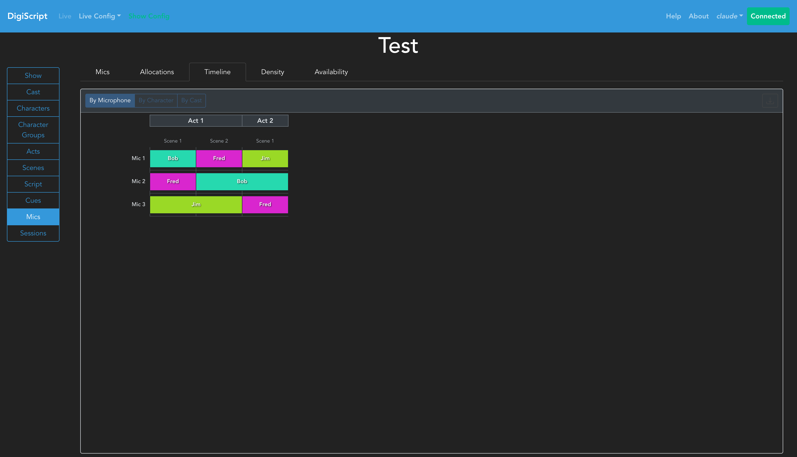

# DigiScript

**Real-time digital script management for theatrical productions**

[](https://github.com/dreamteamprod/DigiScript/actions/workflows/nodelint.yml)

[](https://github.com/dreamteamprod/DigiScript/actions/workflows/pylint.yml)

## Overview

DigiScript is a full-stack web application designed to modernize theatrical show management. Built for stage managers, technical directors, and production teams, it provides real-time script display, intelligent cue management, and collaborative show control in a browser-based interface.

DigiScript eliminates the need for paper scripts and manual cue sheets, while keeping your entire show and team synchronized in real-time.

## Who Should Use DigiScript

**Stage Managers** looking to eliminate paper scripts and manual cue tracking during live performances

**Technical Directors** managing complex shows with multiple cue types and microphone assignments

**Production Teams** needing real-time collaboration across multiple devices during rehearsals and performances

**Theater Companies** running shows over extended periods who need to track session history and maintain multiple script versions

## Key Features

### Real-Time Multi-Client Synchronization

DigiScript's WebSocket-based architecture enables seamless collaboration during live performances. One user acts as the "leader," controlling the script position, while all other connected clients—whether logged in or not—automatically follow along in real-time. If the leader disconnects, the system automatically elects a new leader, ensuring uninterrupted show operations.


*Live show view with color-coded cues synchronized across all connected clients*

### Intelligent Cue Management

Create custom cue types (lighting, sound, special effects, etc.) with visual color coding for instant recognition. Cues can be attached to dialogue lines, stage directions, or dedicated cue lines. The system tracks cues across script revisions, making it easy to manage different versions of your show.


*Cue configuration showing color-coded technical cues attached to script lines*

### Script Revisions

DigiScript's revision system functions like version control for your script. Create new revisions from any previous version, not just the latest, enabling parallel development paths. The visual revision graph shows branching history, making it easy to track changes and roll back if needed. All cues and configurations are tied to specific revisions, preserving the complete history of your production.


*Interactive revision graph showing branching script history with visual node representation*

### Advanced Microphone Management

DigiScript's microphone management system provides graphical allocation matrices for assigning microphones to characters across scenes. The system automatically detects conflicts when the same microphone needs to be reassigned between characters, color-coding them based on urgency (orange for tight changeovers within an act, blue for changeovers across act boundaries with interval time). Multiple visualization modes—by microphone, by character, or by cast member help plan mic usage and identify potential issues before they happen.


*Timeline view showing microphone allocations across scenes with conflict detection*

### Flexible Script Modes

Choose between two show modes tailored to your production style:

- **FULL Mode:** Multi-column layout supporting up to 4 simultaneous speakers per line—ideal for ensemble shows, musicals, and scenes with overlapping dialogue
- **COMPACT Mode:** Single-column streamlined layout—ideal for dialogue-heavy dramas and simpler productions

### Role-Based Access Control (RBAC)

Configure fine-grained permissions for team members. Grant specific users access to edit scripts, manage cues, or start show sessions, while restricting others to view-only access. The permission system operates at the resource level, allowing precise control over who can modify specific show elements.

### Session Tracking & History

Every live show session is recorded with start/end times and can be tagged for organization (e.g., "Dress Rehearsal," "Opening Night"). DigiScript tracks session duration, interval timing, and script position, providing a complete audit trail for your production's run.

## Getting Started

### Requirements

* Node v24.x (npm 11.x)
* Python 3.13.x

### Quick Start with Docker Compose (Recommended)

The easiest way to run DigiScript is through Docker compose (there is a `docker-compose.yml` file [included](./docker-compose.yaml)).:

```shell
docker-compose up -d
```

DigiScript will be available at `http://localhost:8080`

### Manual Installation

#### Client

Build the frontend (output goes to `../server/static/`):

```shell
cd client
npm ci
npm run build
```

#### Server

Install Python dependencies and run the server:

```shell
cd server
pip install -r requirements.txt
python3 main.py
```

The server will be available at `http://localhost:8080`

### First Launch Setup

On first launch, DigiScript will prompt you to create an administrator user. From there, you can create shows, configure users, and begin building your production.

For detailed setup instructions and usage guides, see the [full documentation](https://github.com/dreamteamprod/DigiScript/tree/main/docs).

## License

See the [LICENSE](./LICENSE) file for licensing information.
