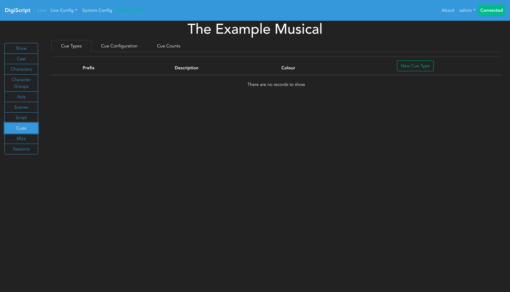
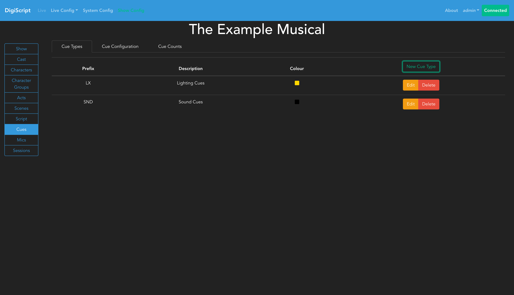
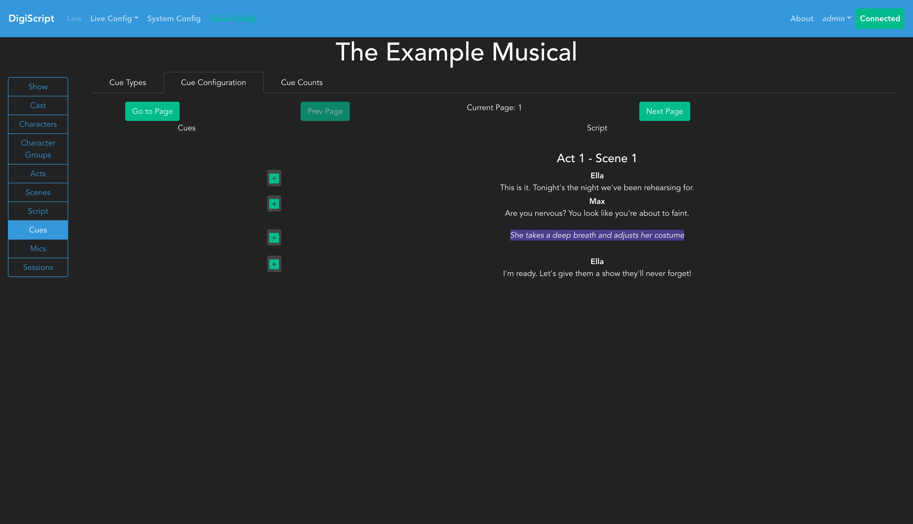
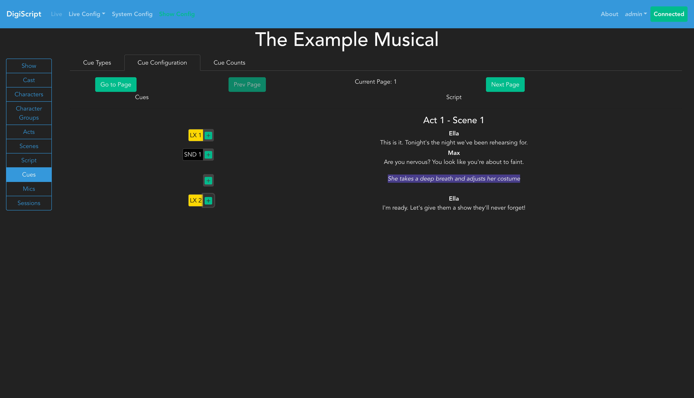

## Configuring Cues

Go to the **Cues** section in the left sidebar to configure cue types and add cues to your script.

### Cue Types

The **Cue Types** tab allows you to Add, Edit, and Delete different cue types. Common examples include Lighting (LX), Sound (SND), or other technical cues specific to your production. When you first access this page, you'll see an empty cue types list:

#### Creating Cue Types

Click **Add** to create a new cue type. For each cue type, you'll need to specify:
- **Prefix**: A short identifier (e.g., "LX" for lighting, "SND" for sound)
- **Description**: A full description of the cue type
- **Color**: A color code to visually distinguish this cue type in the interface

After adding cue types, they will appear in the cue types overview:

The color you choose will be used throughout DigiScript to make different cue types instantly recognizable during configuration and live shows.

### Adding Cues to the Script

The **Cue Configuration** tab allows you to add cues to your script. This interface is similar to the script editing page in layout and function. When first accessed, you'll see your script without any cues:

#### Configuring Cues

To add cues, click **Begin Editing** to request exclusive edit access.

To add a new cue:
1. Click the green **+** button next to the script line where the cue should occur
2. A popup will appear where you select the cue type and provide a cue identifier (e.g., "1" for LX 1)
3. Click **Add** to create the cue

After adding cues, they will appear as colored buttons next to their associated script lines:

Clicking on a cue button allows you to **Edit** or **Delete** that cue. The cue's color matches the color you defined for its cue type, making it easy to identify different types of cues at a glance.

### Cues and Script Revisions

Cues are tied to script revisions - when you add or modify cues, the changes only affect the currently loaded revision. This allows you to maintain different cue configurations for different versions of your script.

Once you've configured your cues, you're ready to run a [Live Show](./live_show.md).