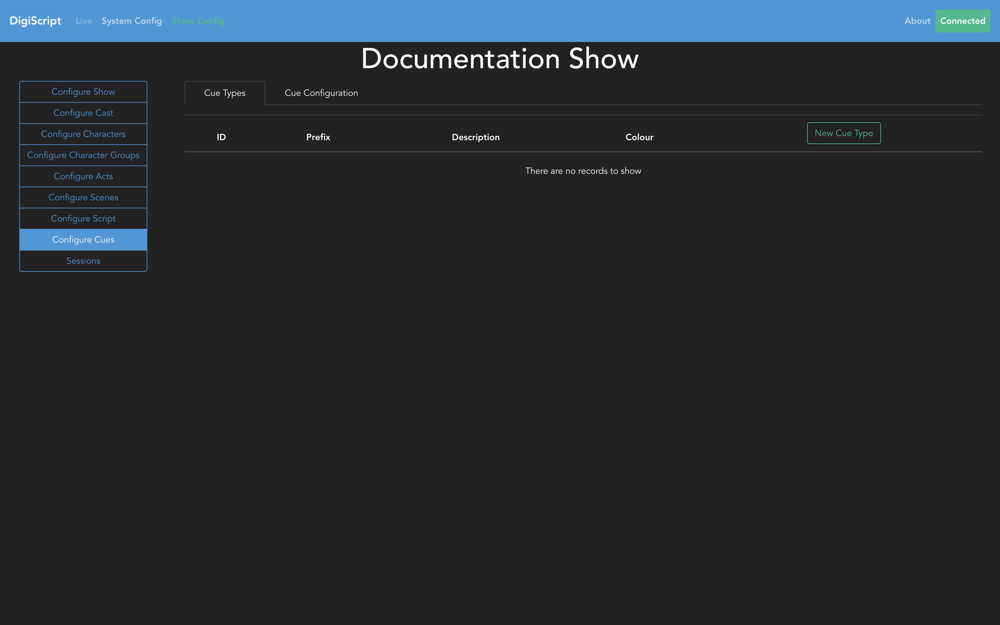
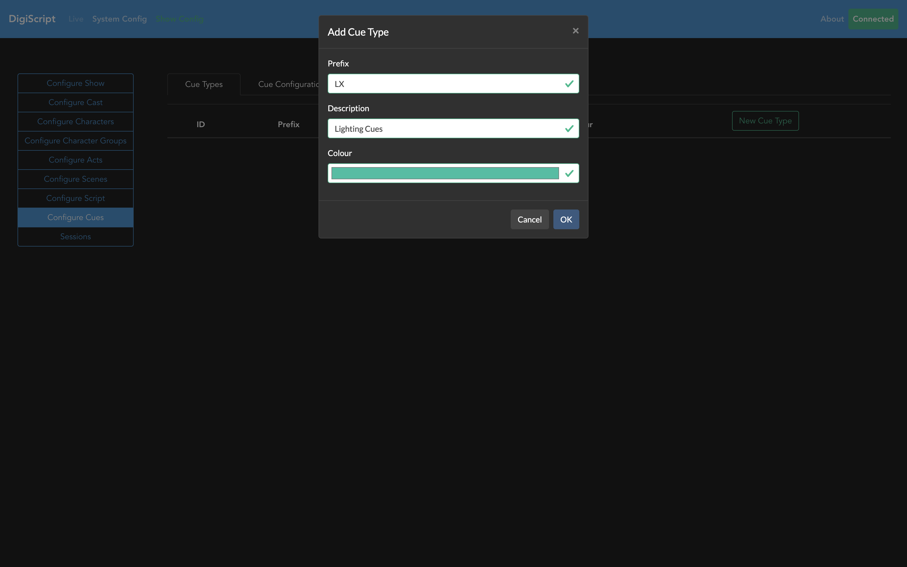
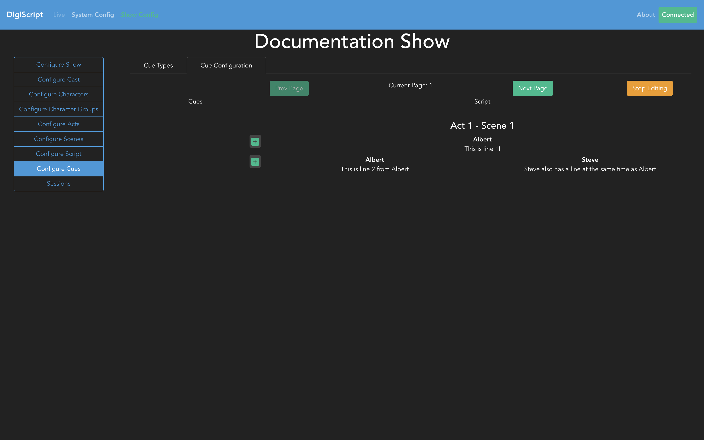
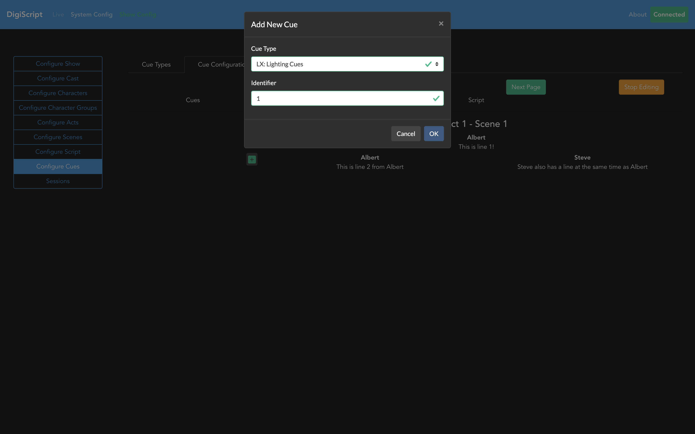
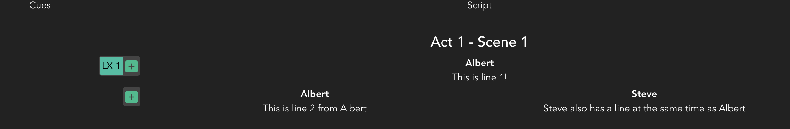

## Configuring Cues

Go to the **Configure Cues** tab to both add new cue types, and add cues into the script.

### Cue Types

The **Cue Types** tab allows you to Add, Edit and Delete different cue types. An example of a cue
type might be Lighting or Sound cues.

When you add a new cue type, you specify the Prefix, Description and a Colour for that type.

### Adding Cues to the Script

The **Cue Configuration** tab allows you to add cues to the script. You will notice that this view
is similar to the script configuration page in terms of layout and function. Again, you will need to
request edit access in order to add cues.

To add a new cue, click on the green + button next to the script line the cue should be associated
with. This will bring up a pop up box where you select the cue type, and give it an identifier.

When the cue has been configured, it will show next to the + button in line with the script line.

Clicking on the cue button itself will allow you to Edit or Delete the cue.

### Cues and Script Revisions

Cues are silently tied to script revisions, this means that new cues will only be added to the
current script revision.

Once any cues have been configured, you can then run a [Live Show](./live_show.md).