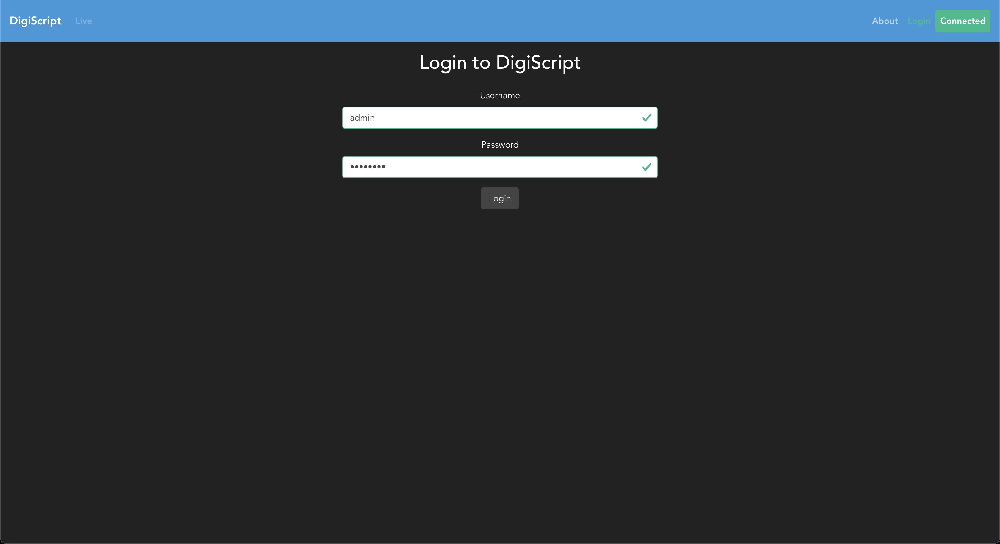
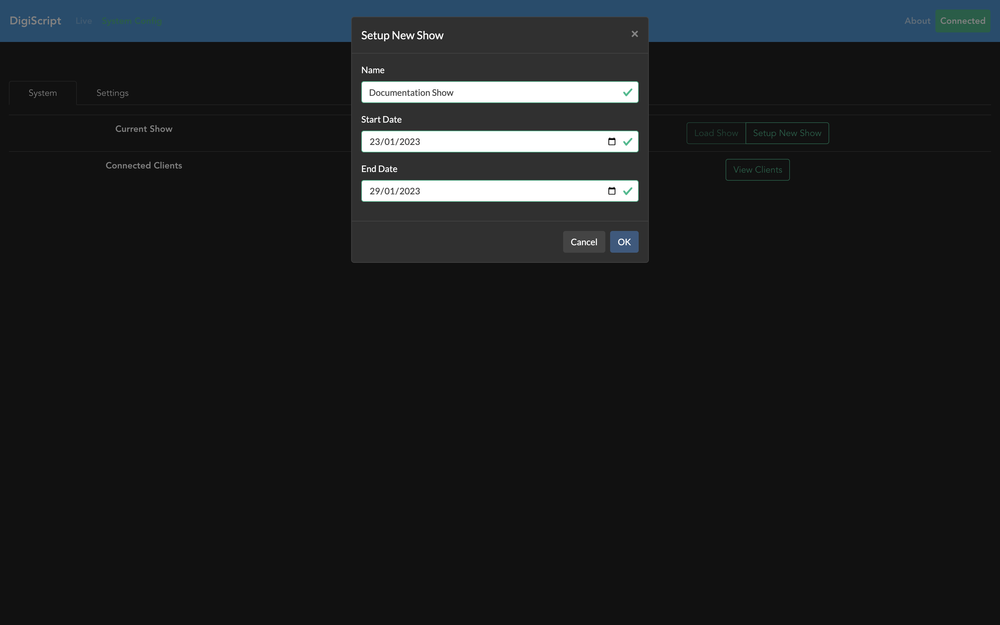

## Getting started with DigiScript

When DigiScript is first loaded, you will see a page similar to the following:

As you can see, before being able to continue you will first need to create an Administrator user.
To do this, enter a password and press `save`, and a new user with the username `admin` will be 
created.

From here, you will need to log in with the new `admin` user that has just been created. Clicking 
on the `login` button in the top right of the navigation pane will allow you to enter the `admin`
username and password from the previous step:

For more information on how to create users for a show, see [Users and RBAC](./user_config.md).

Once the admin user has been created and you have logged in, the first thing to do is set up a new 
show by going to the **System Config** navigation option. This will give you a page that looks like 
this:

Now, we need to create a new show. Clicking the **Setup New Show** button will open up a form to
enter the details about your show, including the name, start date and end date.

Finally, now that we have a show created, we need to go ahead and load this show as the current one
since DigiScript can store multiple shows all from the single database! Use the **Load Show** button
to achieve this!

At this point, we've set up and loaded a new show, and we can now move on to 
[Show Configuration](../pages/show_config.md).