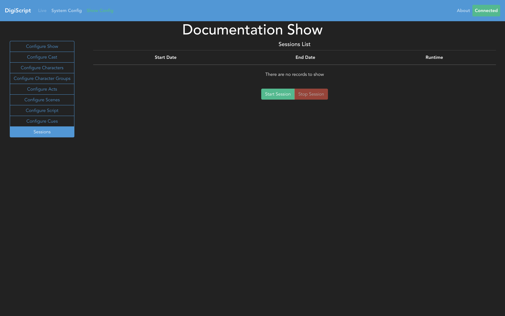
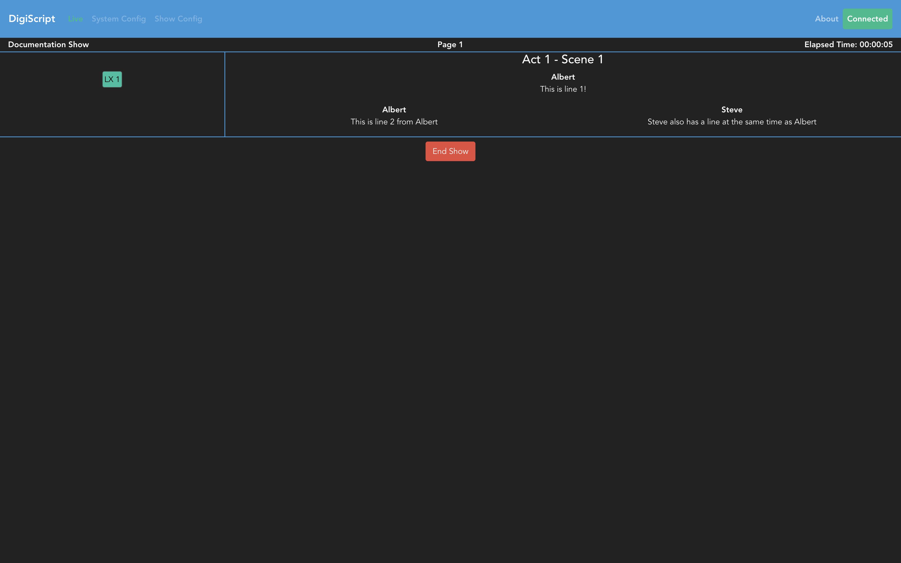

## Running a Live Show

Going to the **Sessions** tab will show previous live sessions, as well as allowing you to start
(and stop) a new live session.

Clicking on the *Start Session* button will start a new live session and navigate you, and all other
connected clients, to the live show page.

This live view shows you the script and cues, as well as the current run time of the session and 
page of the script that the top script line is on. There is also the *End Show* button at the
bottom of the script, which will stop the current live session.