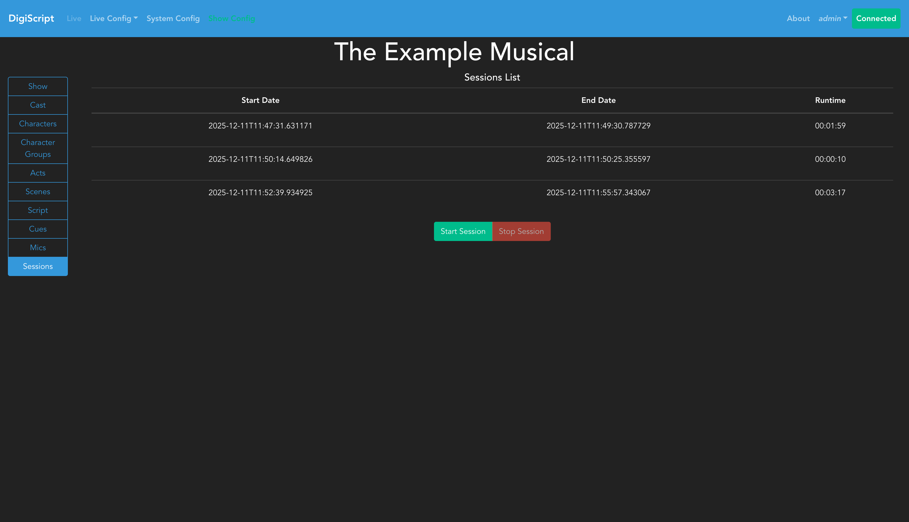
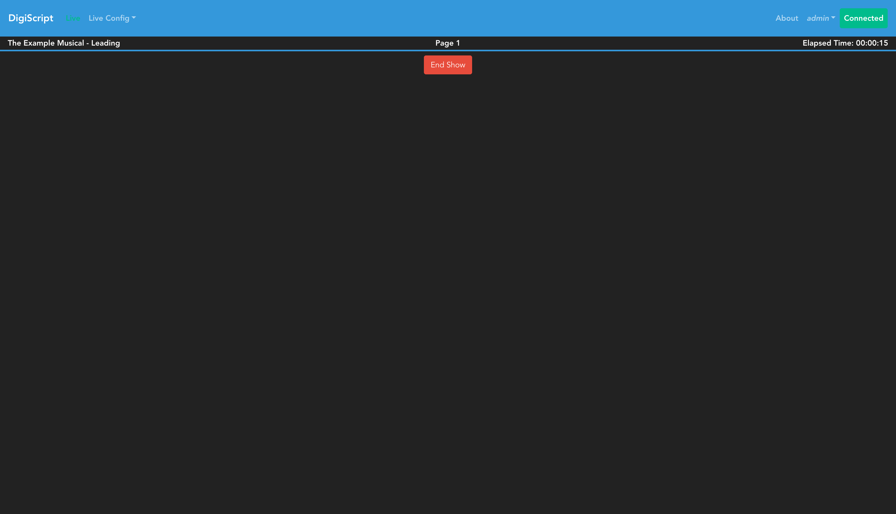
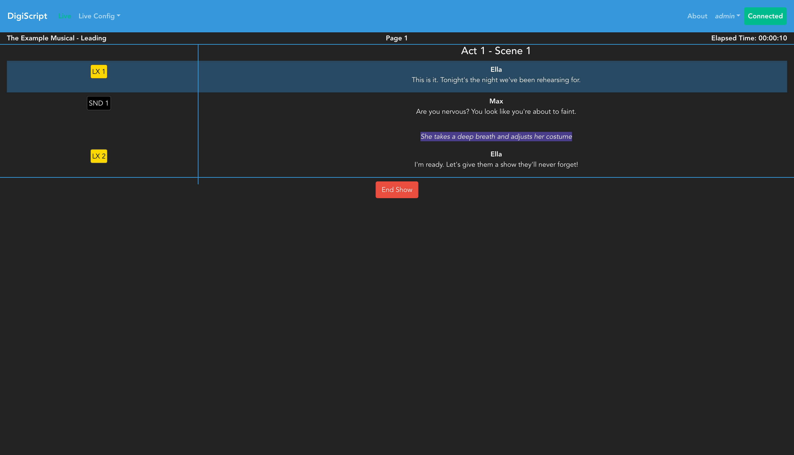

## Running a Live Show

Going to the **Sessions** tab in the Show Config page will show the history of previous live sessions, as well as allowing you to start a new session.

Click the **Start Session** button to begin a new live session. This will automatically navigate you, and all other connected clients, to the live show page.

### Live Show Interface

The live show page displays your script with cues, along with session information:

The interface shows:
- Current run time of the session
- Page number of the current script position
- Script content with associated cues
- **End Show** button to stop the current session

When script content is loaded, you'll see the lines and their associated cues:

### Show Modes

The live show supports three modes:

#### Leader Mode
The user who starts the show session becomes the **leader** for that session. The leader controls the script position, and all other clients automatically follow their view. This is indicated at the top of the page.

#### Follower Mode
All other connected clients (whether logged in or not) will automatically follow the leader's script position. They see the same script content and position as the leader.

#### Manual Mode
If the leader's client becomes disconnected, all other clients become "orphaned" and switch to manual mode, where they can control their own script position independently. When a client logged in as the leader user reconnects, it automatically resumes leadership, and all orphaned clients return to follower mode.

### Act Intervals

If your show has intervals configured between acts, an interval screen will automatically appear between the acts during the live show. The interval will only display if there is script content in both acts surrounding the interval.