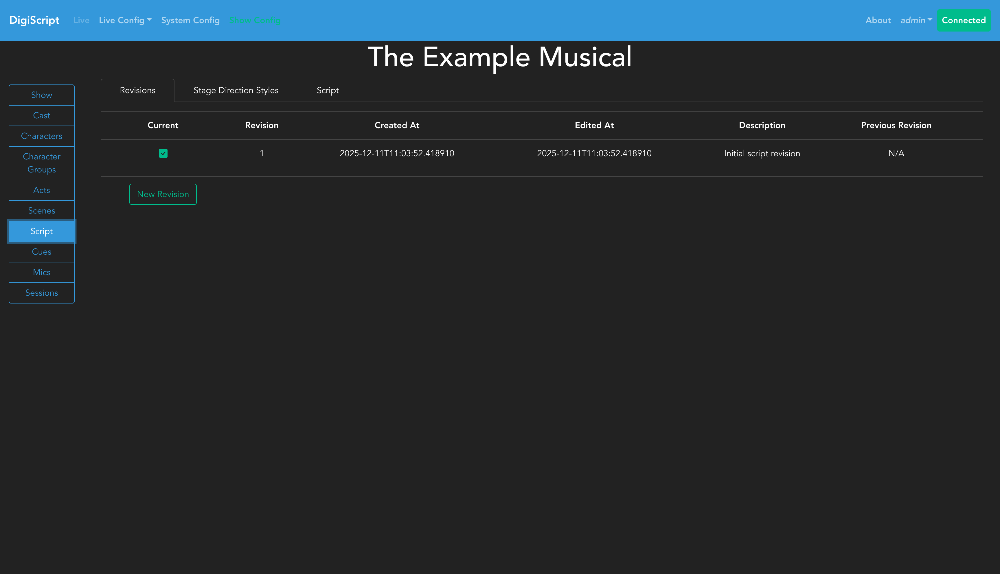
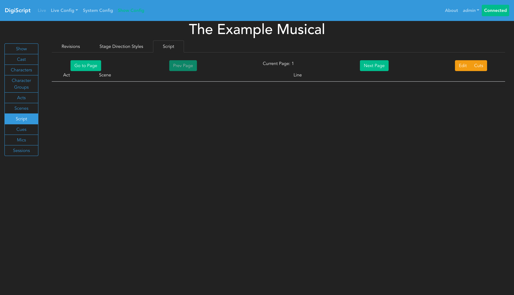
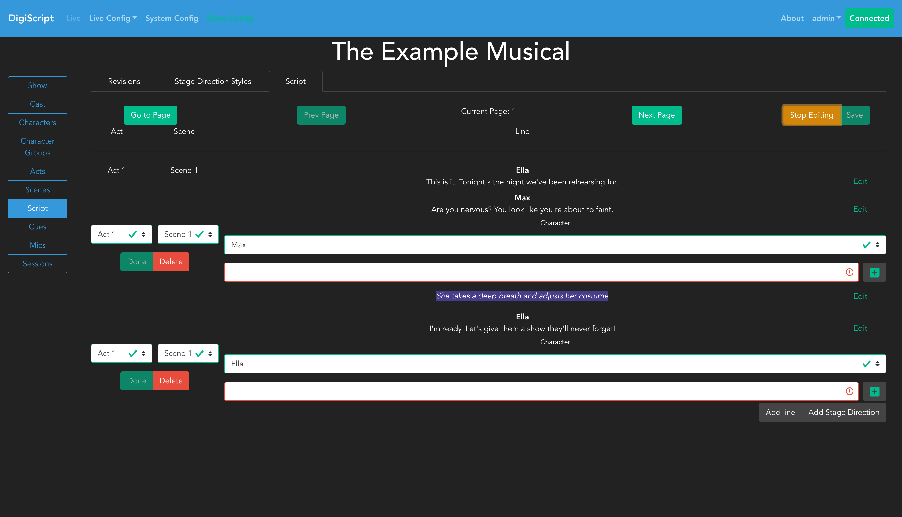
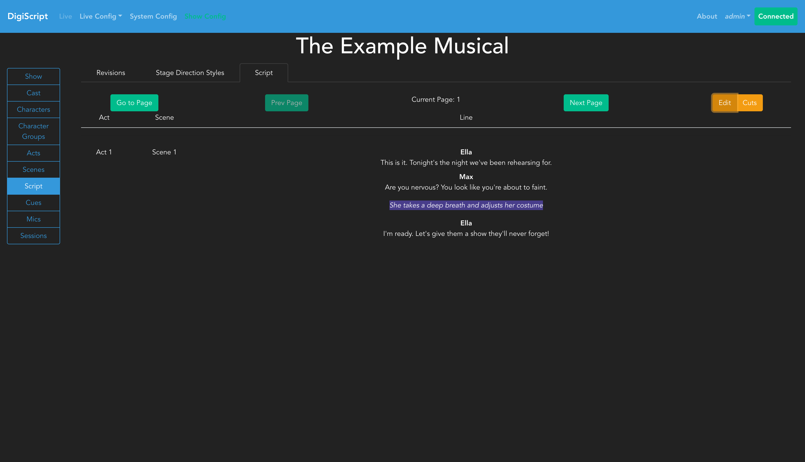

## Configuring the Script

Heading over to the **Script** section in the left sidebar will take you to the page where you can configure script revisions and the script itself.

### Script Revisions

The **Revisions** tab is where you can manage script revisions. The table shows all revisions of the script and allows you to Add, Delete, Edit, or Load a revision.

#### Understanding Script Revisions

Script revisions function similar to version control systems like Git - they track the state of your script at different points in time. This allows you to:
- Roll back the script to a previous version if needed
- Compare what has changed between revisions
- Maintain different versions of the script for different performances

#### Creating a New Revision

Click **New Revision** to create a new revision. You'll need to provide a description for the revision to help identify it later.

When you create a new revision, its base state is copied from the currently loaded revision. Any changes you make to the script after that point will only affect the active revision - other revisions remain unchanged, preserving the complete history of your script.

### Script Content

The **Script** tab is where you edit the actual script content. When you first navigate to this tab, you'll see an empty script interface:

#### Editing the Script

To begin editing, click the **Begin Editing** button. This requests exclusive edit access from the backend, ensuring only one person can edit the script at a time to prevent conflicting changes.

Once you have edit access, you'll see options to **Save** the script, along with buttons for **Add Line** and **Add Stage Direction**.

#### Adding Lines

Click **Add Line** to create a new script line. For each line, you'll need to:
1. Select the **Act** and **Scene** where the line occurs
2. Choose the **Character** or **Character Group** speaking the line
3. Enter the line content itself
4. Click **Done** to finish editing the line

**Important**: After clicking **Done**, DigiScript automatically creates a new empty line. If you don't need this line, click **Delete** before adding your next line. The script cannot be saved while lines are in edit mode.

After adding content, your script will display the lines you've created:

#### Multi-Part Lines

Lines can be made up of multiple parts (up to 4 per line). This is useful for:
- Songs where multiple characters sing simultaneously
- Scenes where characters talk over each other
- Parallel dialogue

Click the green plus button in the line editor to add additional line parts. These will display as multiple columns in the script view.

#### Page Navigation

Use the **Prev Page** and **Next Page** buttons at the top of the editor to navigate between pages of your script as it grows.

#### Saving Your Work

When you're ready to save, ensure no lines are in edit mode, then click the green **Save Script** button. Your changes will be saved to the currently loaded revision.

#### View Mode

After saving, you can switch to view mode to see how the script will appear during a live show:

View mode provides a clean reading interface without the editing controls, similar to what you will see during the show.

Once the script has been configured, you can [Configure Cues](./cue_config.md) or learn how to run a [Live Show](./live_show.md).