## Configuring the Script

Heading over to the **Script** section in the left sidebar will take you to the page where you can configure script revisions and the script itself.

### Script Revisions

The **Revisions** tab is where you can manage script revisions. The table shows all revisions of the script and allows you to Add, Delete, Edit, or Load a revision.

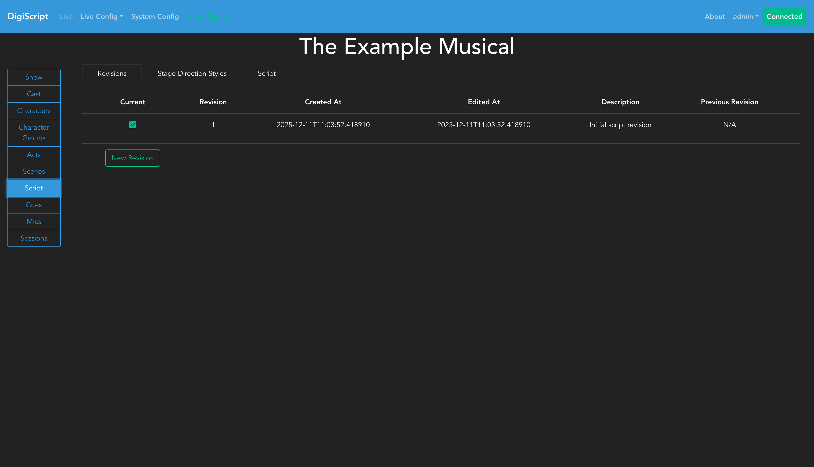

#### Understanding Script Revisions

Script revisions function similar to version control systems like Git - they track the state of your script at different points in time. This allows you to:
- Roll back the script to a previous version if needed
- Compare what has changed between revisions
- Maintain different versions of the script for different performances

#### Revision Branch Graph

The **Revision Branch Graph** provides a visual representation of your script's revision history, showing how revisions branch and evolve over time.

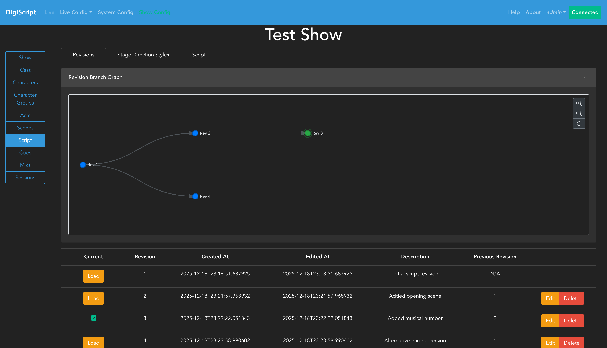

The graph displays:
- **Blue nodes**: Regular revisions
- **Green nodes**: The current active revision (with animated pulse effect)
- **Lines with arrows**: Show the parent-child relationship between revisions

##### Interacting with the Graph

You can interact with the revision graph in several ways:

**Clicking on Nodes**: Click any node in the graph to open a detailed modal showing:
- Revision metadata (number, description, dates)
- Previous (parent) revision
- Child revisions (branches created from this revision)
- Actions: Load This Revision, Create Branch From Here

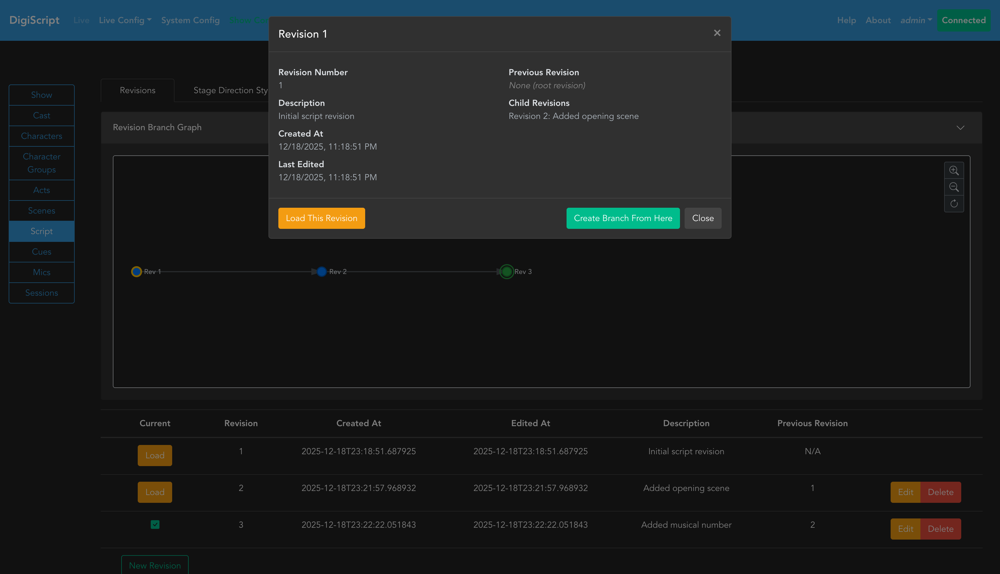

**Pan and Zoom**: Use your mouse or trackpad to pan around the graph and see all revisions. The zoom controls in the top-right corner allow you to:
- Zoom in (+)
- Zoom out (-)
- Reset zoom (↻)

**Collapse the Graph**: Click the chevron icon in the graph header to collapse/expand the graph card, saving screen space when not needed.

##### Creating Branches

You can create alternative versions of your script by branching from any revision:

1. Click on the revision you want to branch from
2. Click **Create Branch From Here** in the detail modal
3. Enter a description for the new branch
4. Click **OK**

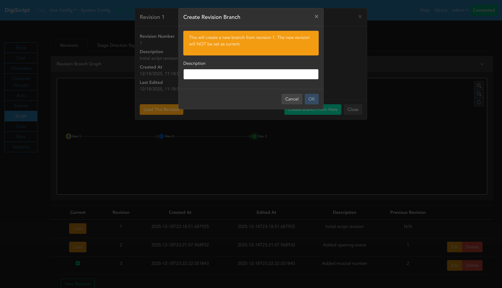

**Important**: When creating a branch from the current revision, the new revision becomes the active revision. When branching from a non-current revision, the new branch is created as an alternative version without changing which revision is currently loaded.

#### Creating a New Revision

Click **New Revision** to create a new revision. You'll need to provide a description for the revision to help identify it later.

When you create a new revision, its base state is copied from the currently loaded revision. Any changes you make to the script after that point will only affect the active revision - other revisions remain unchanged, preserving the complete history of your script.

### Script Content

The **Script** tab is where you edit the actual script content. When you first navigate to this tab, you'll see an empty script interface:

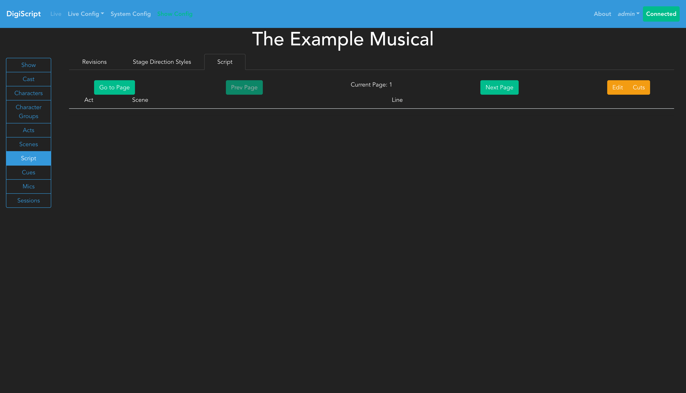

#### Editing the Script

To begin editing, click the **Begin Editing** button. This requests exclusive edit access from the backend, ensuring only one person can edit the script at a time to prevent conflicting changes.

Once you have edit access, you'll see options to **Save** the script, along with a dropdown button for **Add Dialogue** that provides access to all line types.

#### Line Types

DigiScript supports four types of script lines, each serving a specific purpose:

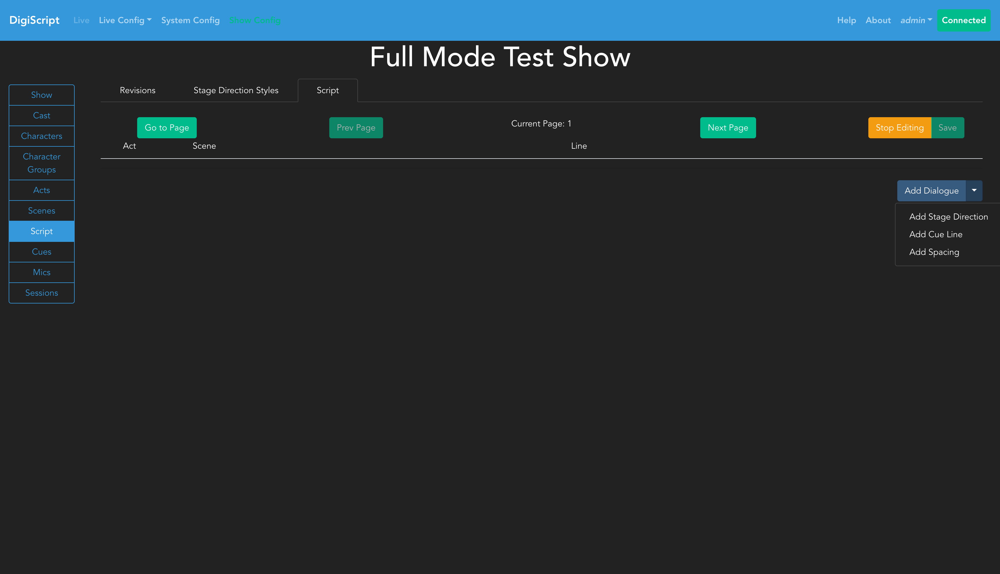

##### Dialogue Lines

The default line type for character speech. Dialogue lines:
- Require a character or character group assignment
- Can contain up to 4 parts (multi-part lines) in FULL mode

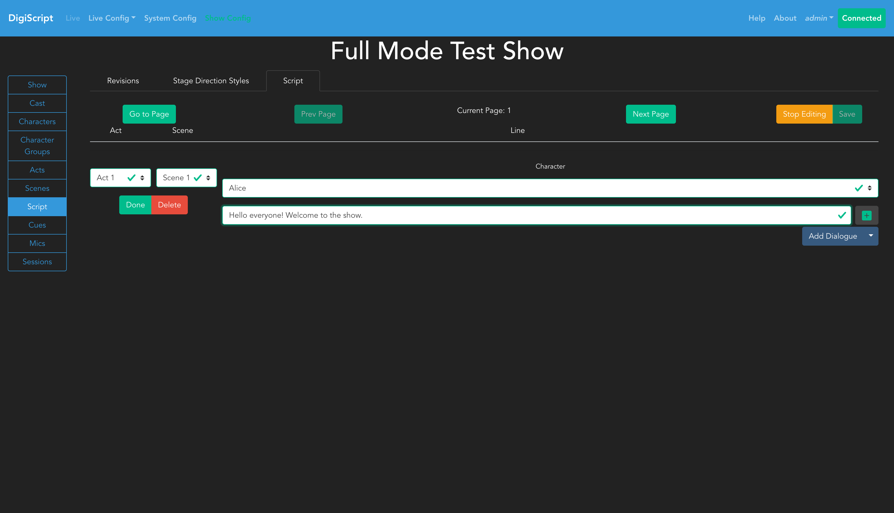

To create a dialogue line:
1. Click **Add Dialogue** (or select it from the dropdown)
2. Select the **Act** and **Scene** where the line occurs
3. Choose the **Character** or **Character Group** speaking the line
4. Enter the line content
5. Click **Done** to finish editing the line

##### Stage Direction Lines

Non-dialogue text for describing actions, movements, or technical directions. Stage direction lines:
- Contain a single text field (no character assignment)
- Display in italic formatting with customizable styling
- Can be styled with Stage Direction Styles (system-level or user preferences)

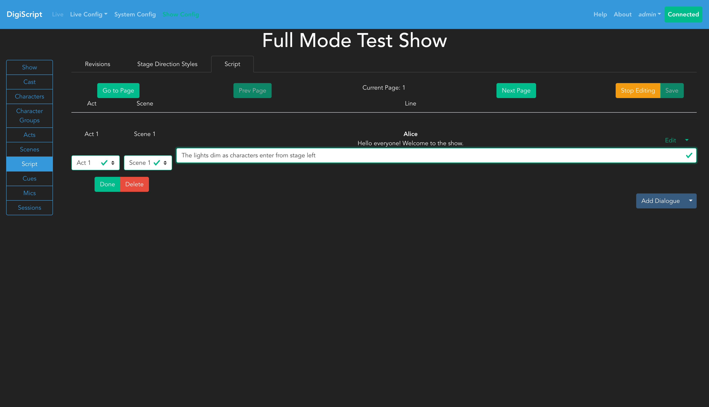

To create a stage direction, select **Add Stage Direction** from the dropdown menu.

##### Cue Lines

Special lines designed for placing technical cues without associated dialogue. Cue lines:
- Have no editable content (displayed as "Cue Lines have no editable content")
- Provide a clean attachment point for cues (LX, SND, etc.)
- Are useful for cues that occur between dialogue or during pauses

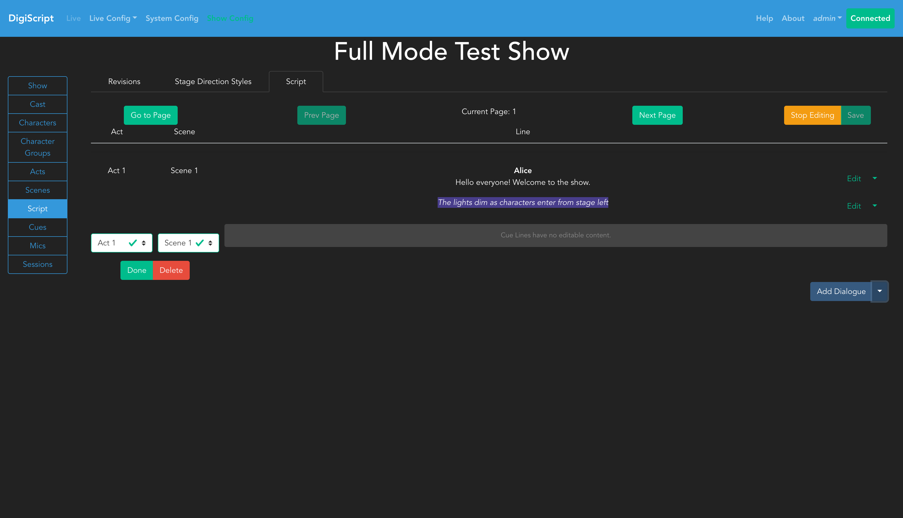

To create a cue line, select **Add Cue Line** from the dropdown menu.

##### Spacing Lines

Blank lines that add vertical spacing in your script. Spacing lines:
- Have no editable content (displayed as "Spacing Lines have no editable content")
- Are automatically hidden in live shows

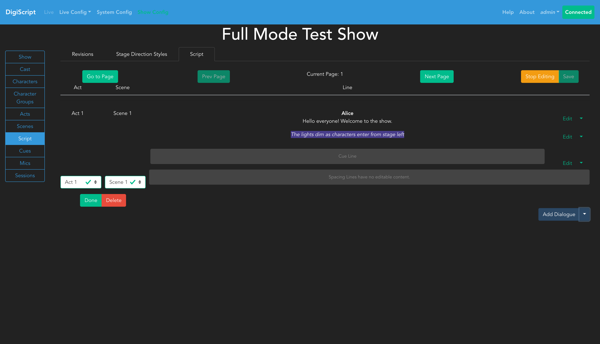

To create a spacing line, select **Add Spacing** from the dropdown menu.

**Important**: After clicking **Done**, DigiScript automatically creates a new empty line. If you don't need this line, click **Delete** before adding your next line. The script cannot be saved while lines are in edit mode.

#### Multi-Part Lines

Dialogue lines can be made up of multiple parts (up to 4 per line) in **FULL mode**. This is useful for:
- Songs where multiple characters sing simultaneously
- Scenes where characters talk over each other
- Parallel dialogue

Click the green plus button in the line editor to add additional line parts. These will display as multiple columns in the script view.

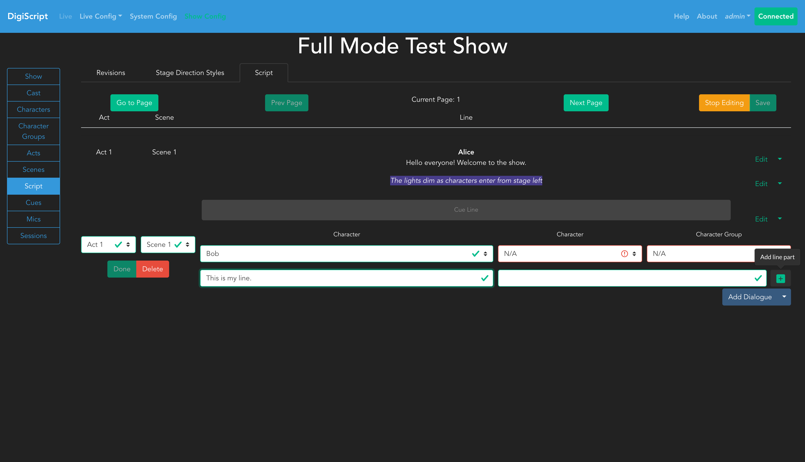

**Note**: In COMPACT mode, multi-part lines are not available as the layout is optimized for single-column display. The add button for additional parts will not be visible when editing shows configured with COMPACT mode.

#### Page Navigation

Use the **Prev Page** and **Next Page** buttons at the top of the editor to navigate between pages of your script as it grows.

#### Saving Your Work

When you're ready to save, ensure no lines are in edit mode, then click the green **Save Script** button. Your changes will be saved to the currently loaded revision.

#### View Mode

After saving, you can switch to view mode to see how the script will appear during a live show:

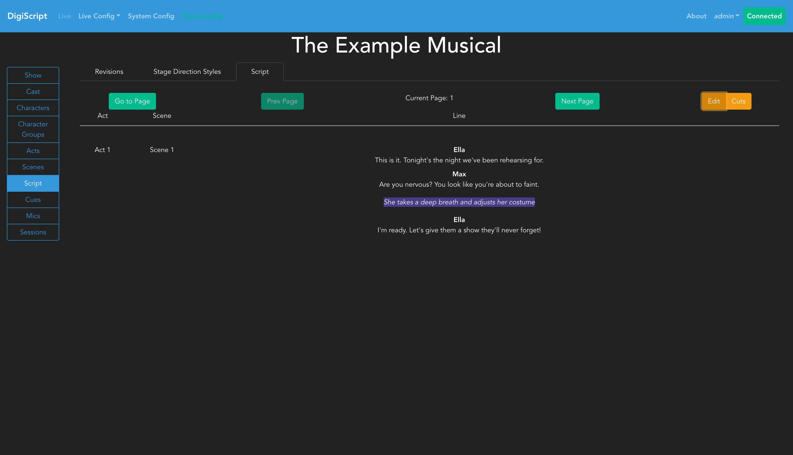

View mode provides a clean reading interface without the editing controls, similar to what you will see during the show.

Once the script has been configured, you can [Configure Cues](./cue_config.md) or learn how to run a [Live Show](./live_show.md).