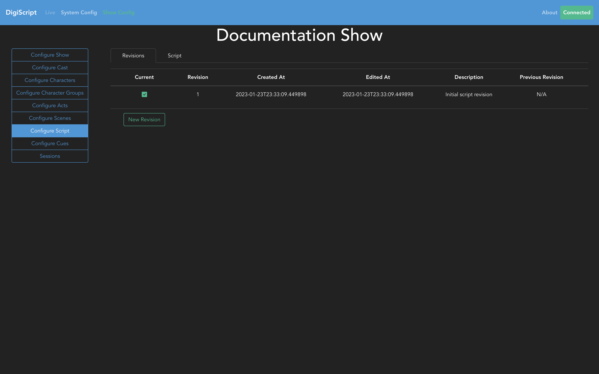

## Configuring the Script

Heading over to the **Configure Script** tab on the left hand side will take you to the page where
you can configure script revisions, and the script itself.

### Script Revisions

The **Revisions** tab is where you can configure revisions to the script. The table shows all the
revisions to the script currently, and allows you to Add, Delete, Edit or Load a revision.

Conceptually, a script revision is a reflection of the state of the script at a current point in
time. It is similar in function to tools like Git in that it is used to track changes to the script.
This allows you to roll back the script to a point in time if needed, or just check to see what has
changed.

Clicking on *New Revision* allows you to configure a new revision, all this requires is a description
of the revision.

When a new revision of the script is created, the base state of the revision is set based on the 
currently loaded revision. Any changes you make to the script after that point will not change the 
state of the script in any other revisions, thus tracking the changes.

### Script Content

The **Script** tab is where the actual script is configured. 

The first thing you will need to do is
click the *Begin Editing* button to enable edit mode. This in turn will request edit access from
the backend, ensuring that only one person can edit the script at a time to avoid any conflicting
writes.

Once you have obtained access from the backend, you will see option to *Save* the script, and
buttons for *Add Line* and *Add Stage Direction* actions. Clicking on *Add Line* will create a new
line object which can be filled in.

Select the Act, Scene, Character or Character Group from the dropdowns, and then add the line
content itself.

Once all this is filled in, click *Done* to close the line editor and view the line as part of the
script.

Lines can also be made up of multiple parts, for example during songs where there may be multiple
parts at the same time, or in a part of a scene where characters are talking over each other.

Clicking the green plus button in the line editor will add a new line part (up to 4 per line 
total).

This will then show as multiple columns on the script view when the line has finished being edited.

Use the *Prev Page* and *Next Page* buttons at the top of the configuration editor to change the
page that is being edited.

Finally, save the script by pressing the green *Save Script* button.

Once the script has been configured, you can [Configure Cues](./cue_config.md) or learn how to run a
[Live Show](./live_show.md).