## Configuring a Show

Heading over to the **Show Config** navigation option at the top of the page will bring you to an
overview of the current show, and gives you all the tabs for different parts of the show that you
can configure.

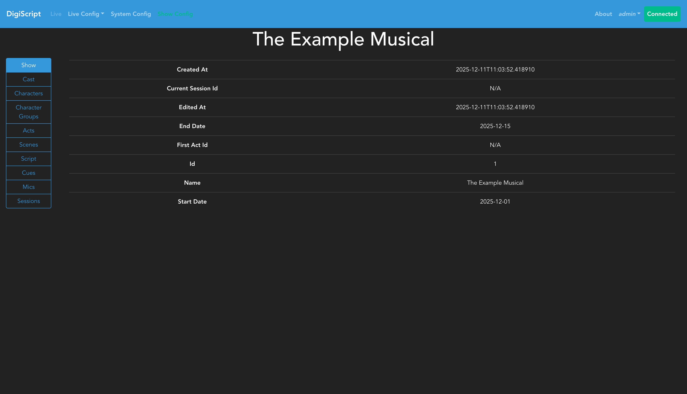

### Cast, Characters and Character Groups

The first thing a show needs is a cast! The **Configure Cast** tab on the left hand side will take
you to the place to configure your cast.

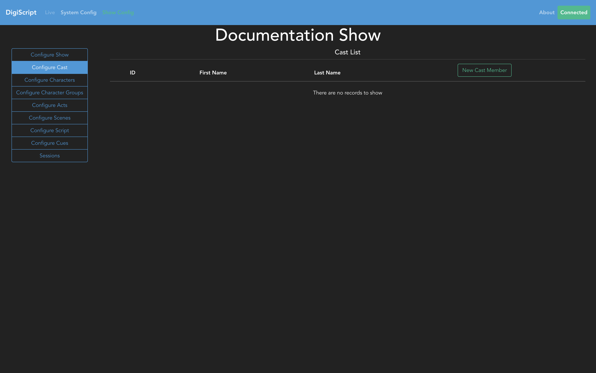

From here, you can Add, Edit and Delete cast members.

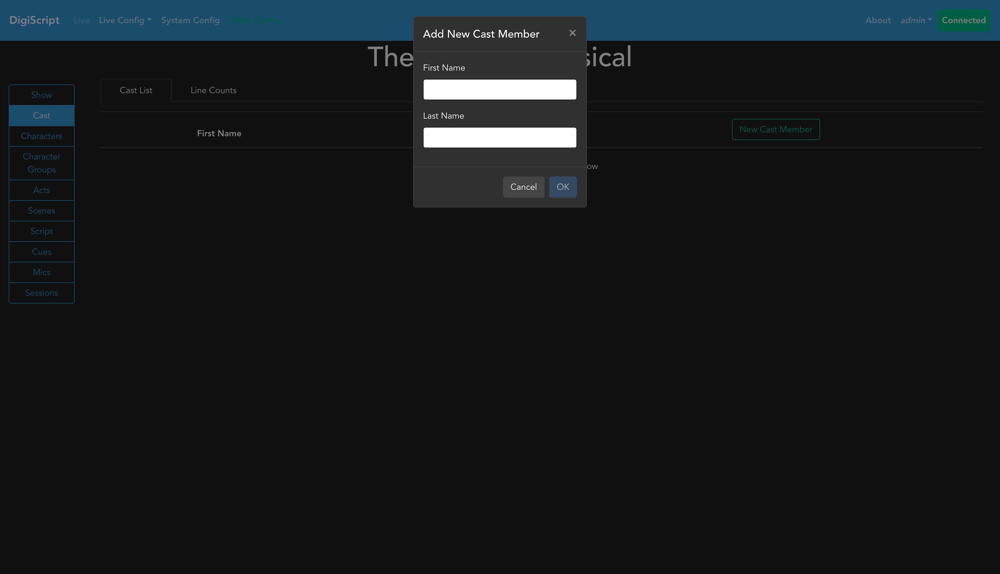

Once the cast has been configured, the next step is to go to the **Configure Characters** tab to start
inputting details about the show's characters.

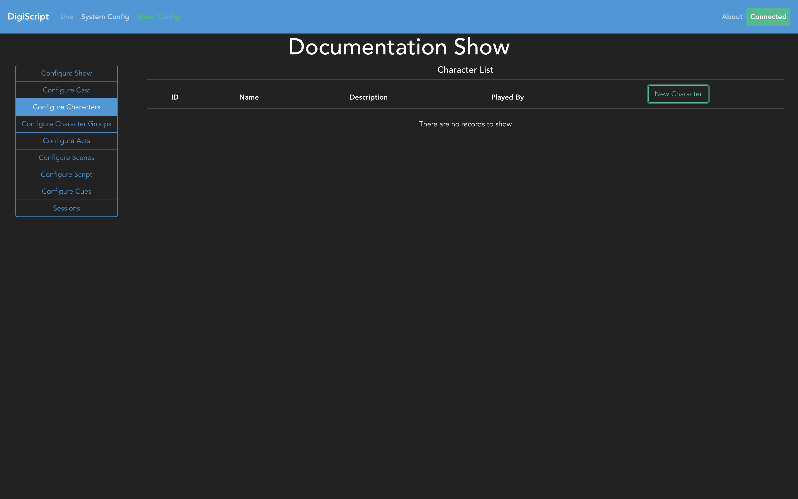

Here, you can Add, Edit and Delete characters as exampled below. When creating a character, you can
optionally reference the cast member that they are played by.

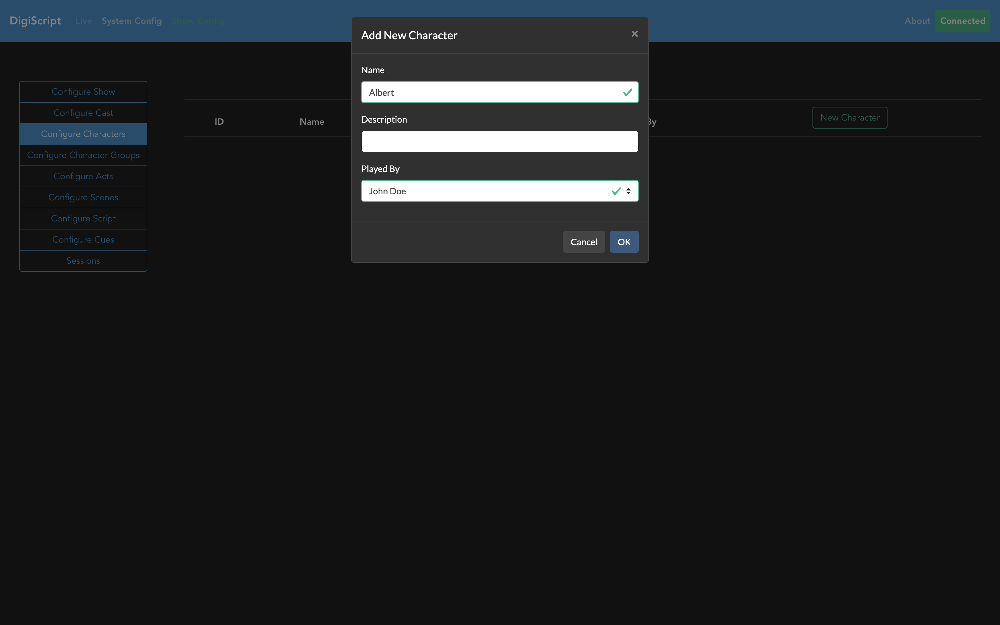

The final part of cast and character configuration is to configure any character groups. This is
conceptually just a group of characters that may all have the same lines in a song for example, 
where the script does not display each individual name. Going to the **Configure Character Groups**
tab allows you to do this.

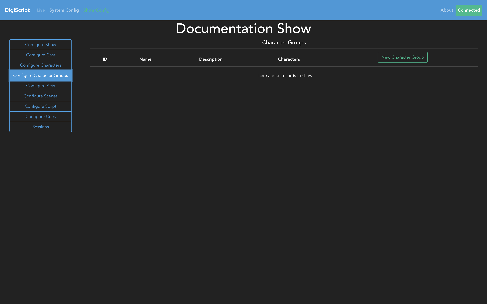

When creating a character group, you can optionally assign characters to this group. The reason for
this being optional is that you can choose to use the character groups to represent the Chorus for 
example, as this is not usually comprised of named characters.

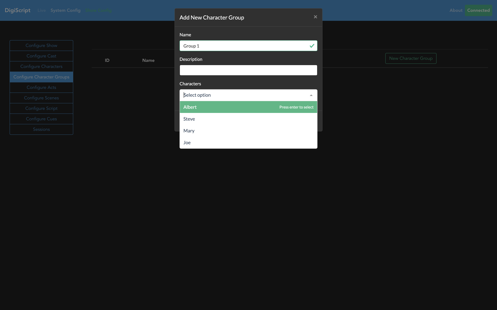

### Acts and Scenes

A show is made up of acts and scenes, so these are the next things to configure. Going to the
**Configure Acts** tab will allow you to start this process.

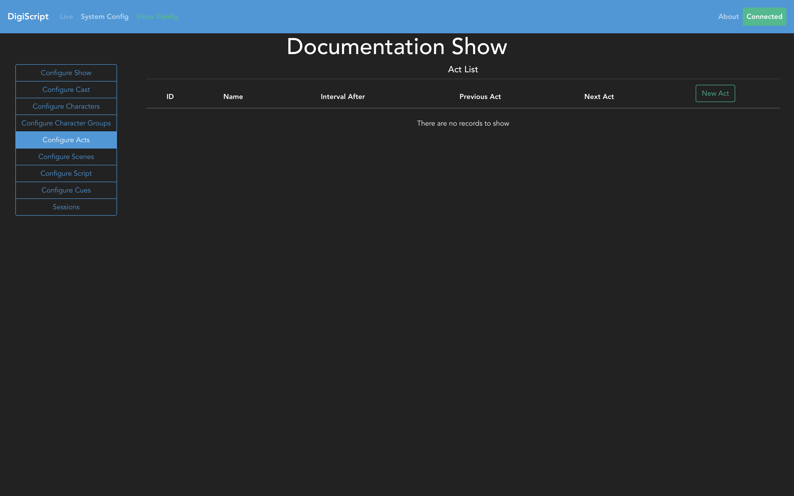

From here, you can Add, Edit and Delete acts. Be sure to set the **Previous Act** field to create the
correct order of acts in the show.

With the acts configured, next step is to set up the scenes. Going to the **Configure Scenes** tab
will bring up the overview page of all the scenes in the show.

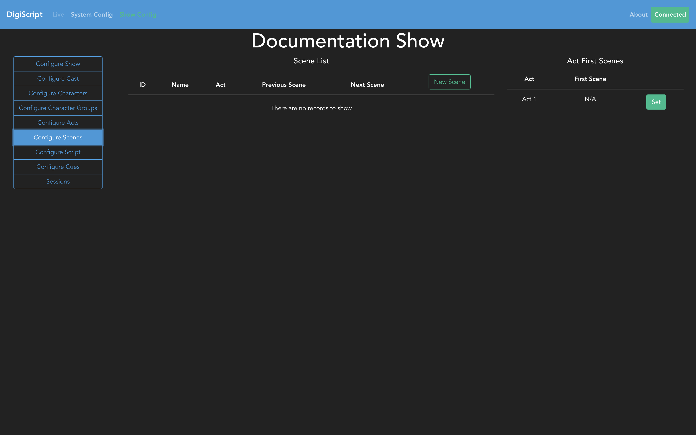

From this page, you can Add, Edit and Delete scenes. When creating a new scene, you will need to
specify the *Act*, as well as the *Previous Scene* in order to create the correct ordering of
scenes.

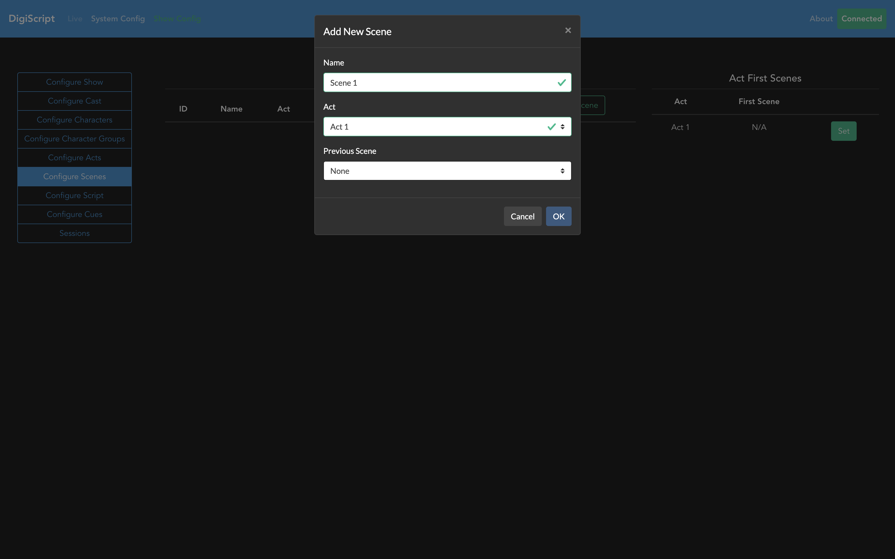

Finally, once all the acts and scenes are configured, you will need to set the first scene of each
act using the table on the right hand side of the scenes table.

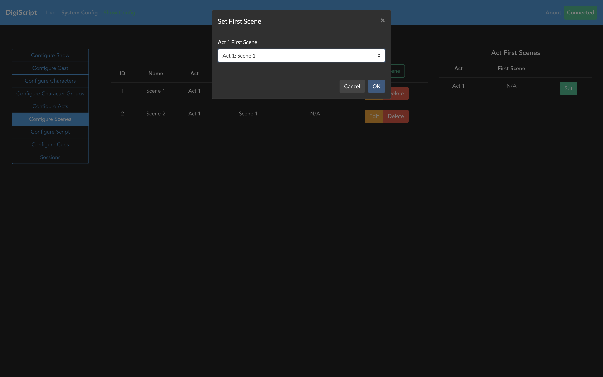

### Setting the First Act

Finally, once all the acts and scenes are created, and the correct ordering of these specified, the
final task is to go back to the **Configure Show** tab, and use the *Edit Show* option to configure the
first act of the show.

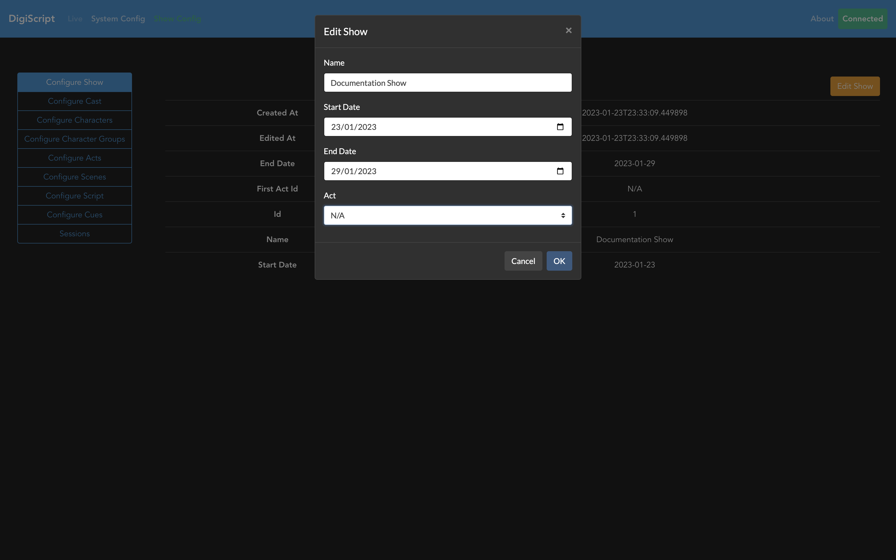

This final step ensures that there is the correct ordering of acts and scenes within those acts, to
ensure that the script can be properly set up.

At this point, the show has been fully configured with acts and scenes, so the next step is to move
on to [Script Configuration](./script_config.md).