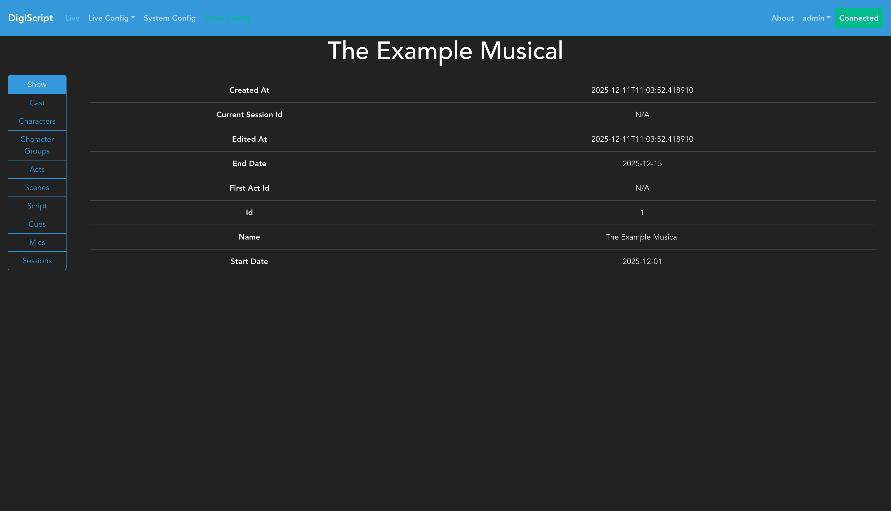
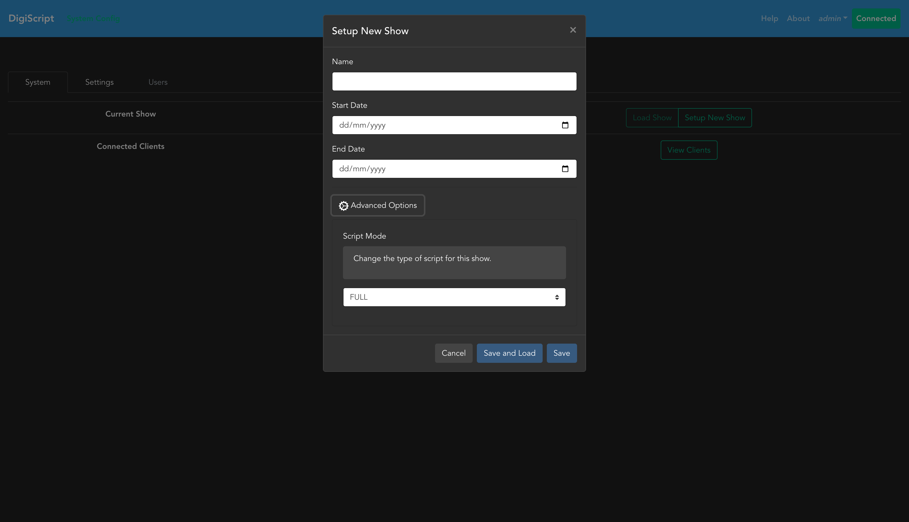

## Configuring a Show

Heading over to the **Show Config** navigation option at the top of the page will bring you to an overview of the current show. The navigation sidebar on the left provides access to all the configuration sections for your show.

### Configuration Sections

The Show Config page is organized into several sections, each accessible from the left sidebar:

- **Show**: View and edit basic show information (name, dates, settings)
- [Staging](./show_config/stage_management.md): Manage crew, props, and scenery for your production
- [Cast, Characters and Character Groups](./show_config/cast_and_characters.md): Manage performers and roles
- [Acts and Scenes](./show_config/acts_and_scenes.md): Structure your show's timeline
- **Script**: Create and edit the show script with revisions
- **Cues**: Configure cue types and assign cues to script lines (see [Cue Configuration](./cue_config.md))
- [Microphones](./show_config/microphones.md): Set up microphones and allocate them to characters
- **Sessions**: View the history of live show sessions

### Configuration Workflow

The recommended workflow for configuring a new show is:

1. Add [Cast and Characters](./show_config/cast_and_characters.md)
2. Create [Acts and Scenes](./show_config/acts_and_scenes.md)
3. (Optional) Select Script Mode for your show
4. [Set the First Act](./show_config/first_act.md) (vital for script ordering - usually handled automatically)
5. Move on to [Script Configuration](./script_config.md)
6. Configure [Cues](./cue_config.md)
7. Optionally set up [Microphones](./show_config/microphones.md)
8. Optionally configure [Stage Management](./show_config/stage_management.md) (crew, props, scenery)

### Script Display Modes

DigiScript supports two script display modes that affect how your script appears during editing and live performances. This setting is chosen when creating a new show in the Advanced Options section.

#### FULL Mode (Default)

The traditional multi-column layout. This mode is ideal for:
- Shows with frequent multi-part dialogue (up to 4 simultaneous speakers)

#### COMPACT Mode

A streamlined single-column layout. This mode is ideal for:
- Simple dialogue-heavy shows

**Note**: The script mode is set during show creation and affects the entire show. It cannot be changed after the fact.

Once your show is fully configured, you're ready to [run a live show](./live_show.md)!