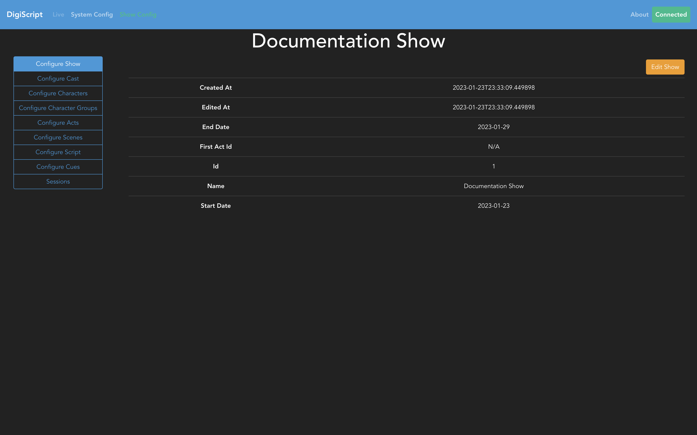

## Configuring a Show

Heading over to the **Show Config** navigation option at the top of the page will bring you to an
overview of the current show, and gives you all the tabs for different parts of the show that you
can configure.

### Configuration Steps

- [Cast, Characters and Character Groups](./show_config/cast_and_characters.md)
- [Acts and Scenes](./show_config/acts_and_scenes.md)
- [Setting the First Act](./show_config/first_act.md)
- [Microphones](./show_config/microphones.md)

At this point, the show has been fully configured with acts and scenes, so the next step is to move
on to [Script Configuration](./script_config.md).