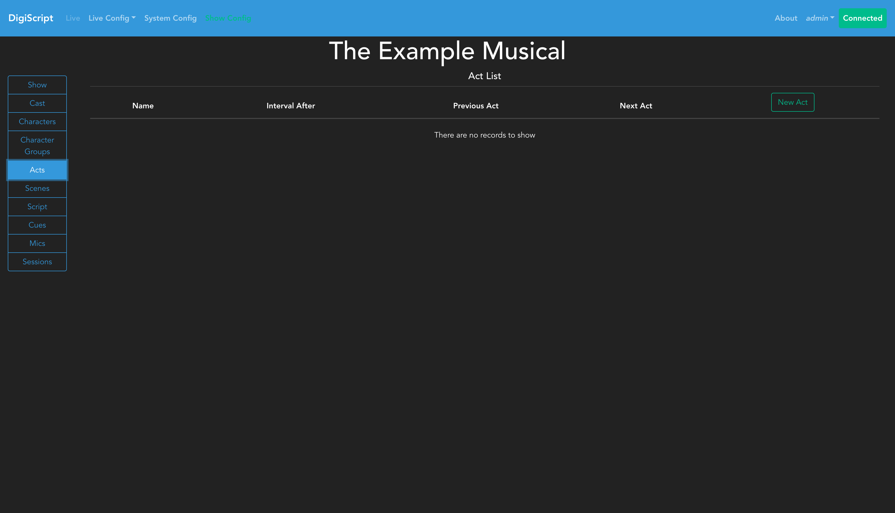
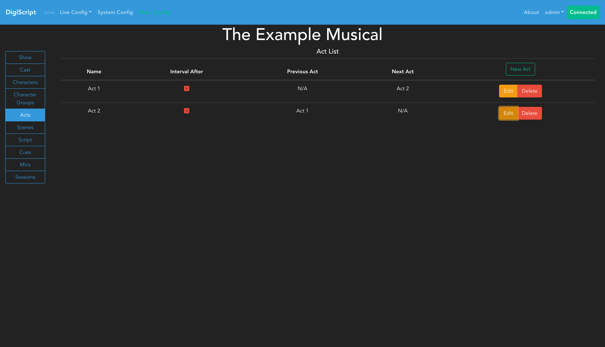
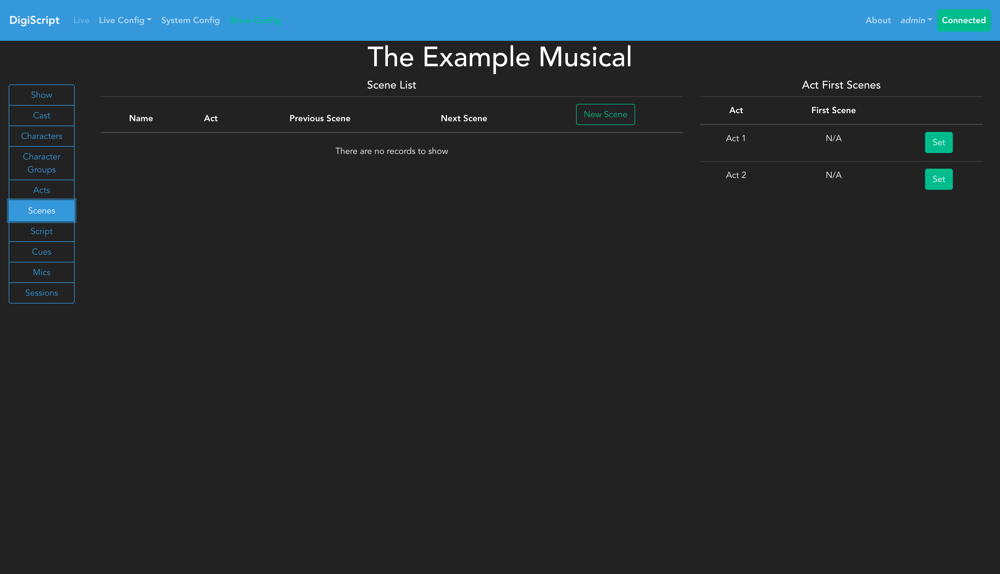
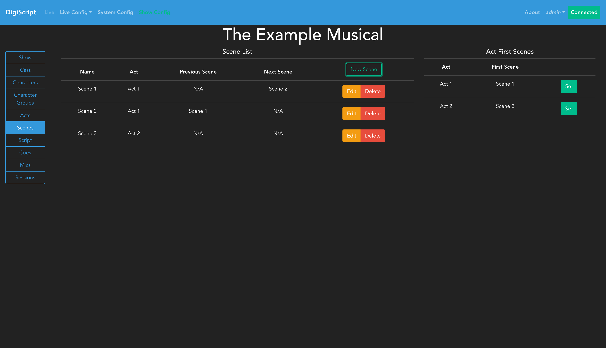

## Configuring a Show

### Acts and Scenes

A show is made up of acts and scenes, so these are the next things to configure. Going to the **Configure Acts** tab will allow you to start this process. When you first access this page, you'll see an empty acts list:

#### Adding Acts

Click the **Add** button to create a new act. You'll need to provide an act name and can optionally set the **Previous Act** field to establish the correct ordering of acts in the show. You can also configure whether there is an interval after this act.

After adding acts, you'll see them listed in the acts overview:

You can use the **Edit** and **Delete** buttons to manage existing acts.

#### Configuring Scenes

With the acts configured, the next step is to set up the scenes. Going to the **Configure Scenes** tab will bring up the overview page of all scenes in the show. Initially, the scene list will be empty:

Click **Add** to create a new scene. When creating a scene, you must specify which **Act** it belongs to, and you should set the **Previous Scene** field to establish the correct ordering of scenes within that act.

After adding scenes, they will appear in the scenes overview:

Scenes can be edited or deleted using the corresponding buttons. The scenes table displays which act each scene belongs to and their ordering within the show.