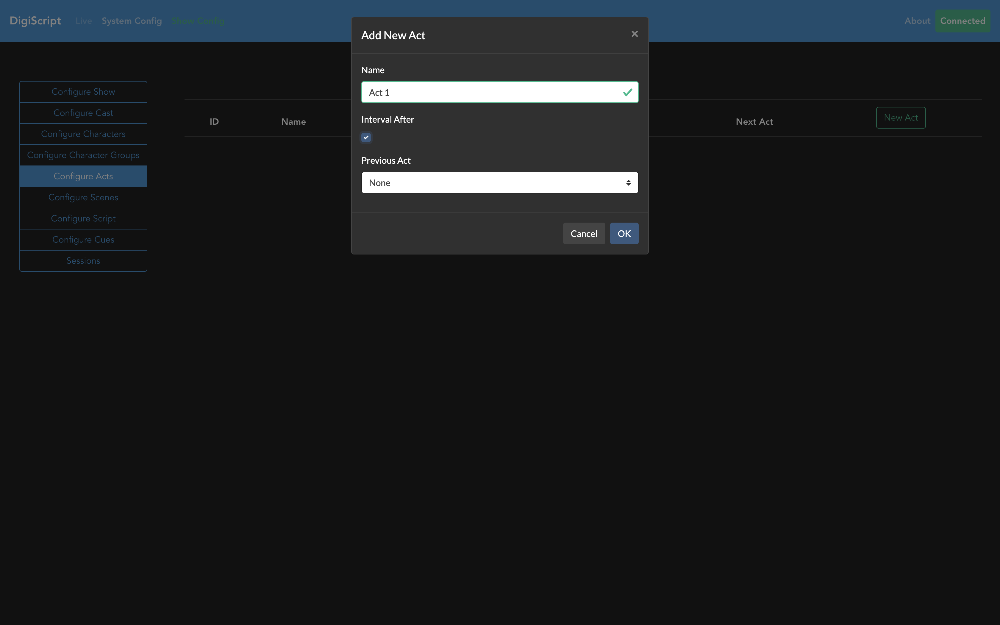
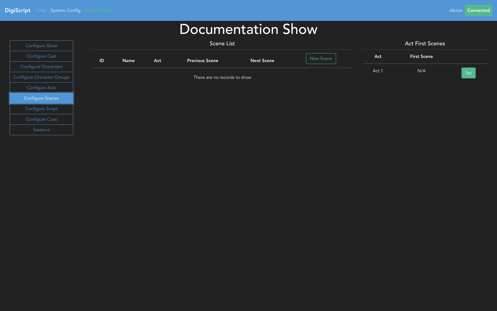

## Configuring a Show

### Acts and Scenes

A show is made up of acts and scenes, so these are the next things to configure. Going to the
**Configure Acts** tab will allow you to start this process.

From here, you can Add, Edit and Delete acts. Be sure to set the **Previous Act** field to create the
correct order of acts in the show.

With the acts configured, next step is to set up the scenes. Going to the **Configure Scenes** tab
will bring up the overview page of all the scenes in the show.

From this page, you can Add, Edit and Delete scenes. When creating a new scene, you will need to
specify the *Act*, as well as the *Previous Scene* in order to create the correct ordering of
scenes.

Finally, once all the acts and scenes are configured, you will need to set the first scene of each
act using the table on the right hand side of the scenes table.

