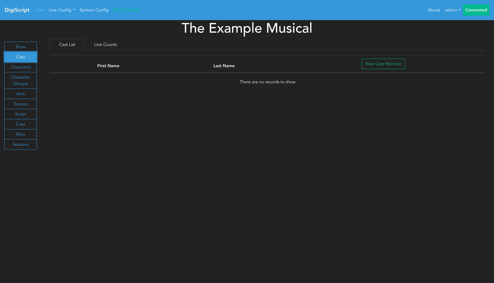
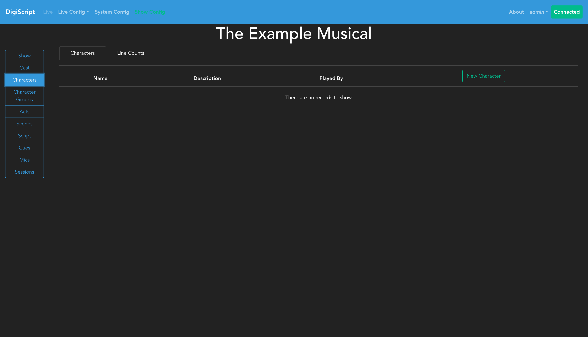
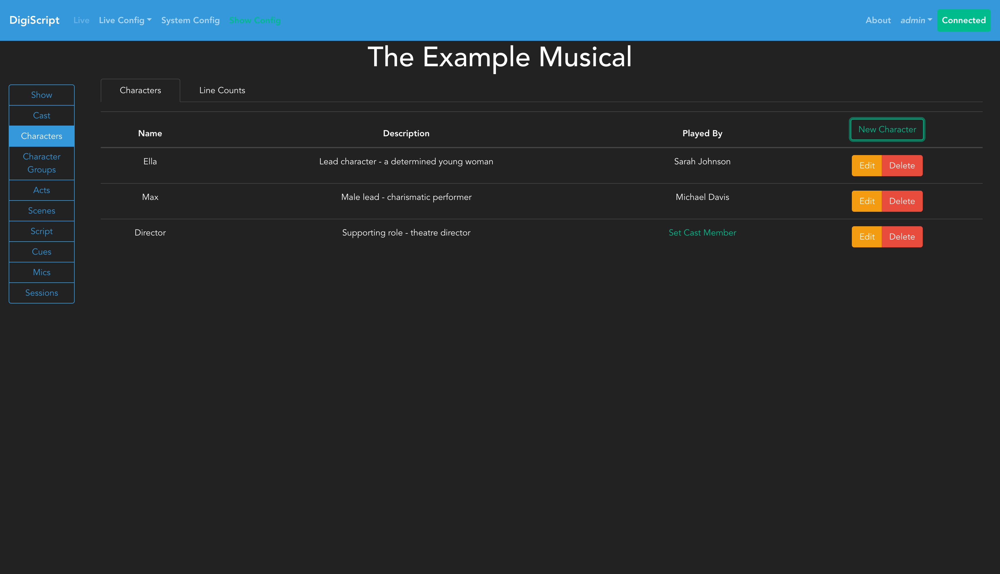
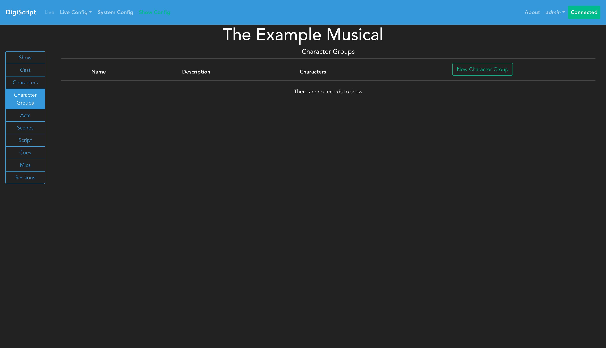
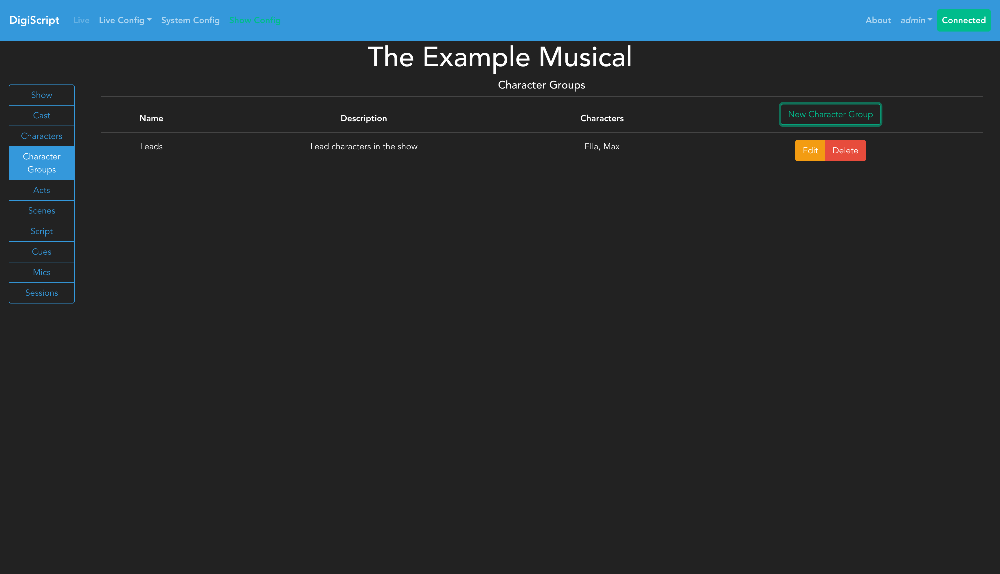

## Configuring a Show

### Cast, Characters and Character Groups

The first thing a show needs is a cast! The **Configure Cast** tab on the left sidebar will take you to the cast configuration page. When you first navigate to this page, you'll see an empty cast list:

#### Adding Cast Members

Click the **Add** button to create a new cast member. Enter their first name and last name in the form:

After adding cast members, you'll see them listed in the cast overview:

You can use the **Edit** and **Delete** buttons to manage existing cast members.

#### Configuring Characters

Once the cast has been configured, the next step is to go to the **Configure Characters** tab to start inputting details about the show's characters. Initially, the character list will be empty:

Click the **Add** button to create a new character. When creating a character, you must provide a character name. You can optionally assign a cast member to play this character by selecting them from the dropdown menu. This allows you to link characters to their performers:

Characters can be edited or deleted using the corresponding buttons. If a character is not assigned to a cast member, they will appear as "Uncast" in the character list.

#### Character Groups

The final part of cast and character configuration is to set up character groups. Character groups are useful for representing multiple characters who speak together, such as in ensemble numbers or chorus sections where the script doesn't list individual character names.

Navigate to the **Configure Character Groups** tab to manage these groups. When first accessing this section, you'll see an empty list:

Click **Add** to create a new character group. You can optionally assign existing characters to this group by selecting them from the available characters list. This is particularly useful for groups like "Leads" or "Ensemble" that consist of named characters.

Character groups can also represent performers who aren't named characters in the show, such as a general "Chorus" - in these cases, you would create the group without assigning any specific characters to it.

Once configured, character groups can be used when writing script lines, allowing you to assign dialogue to groups of performers rather than individual characters.