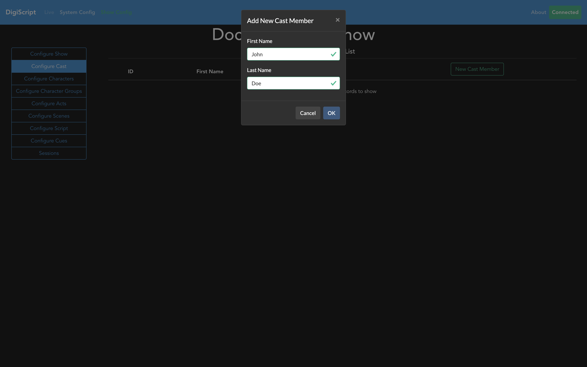
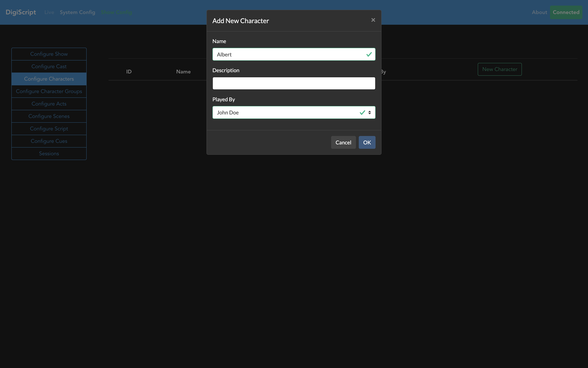
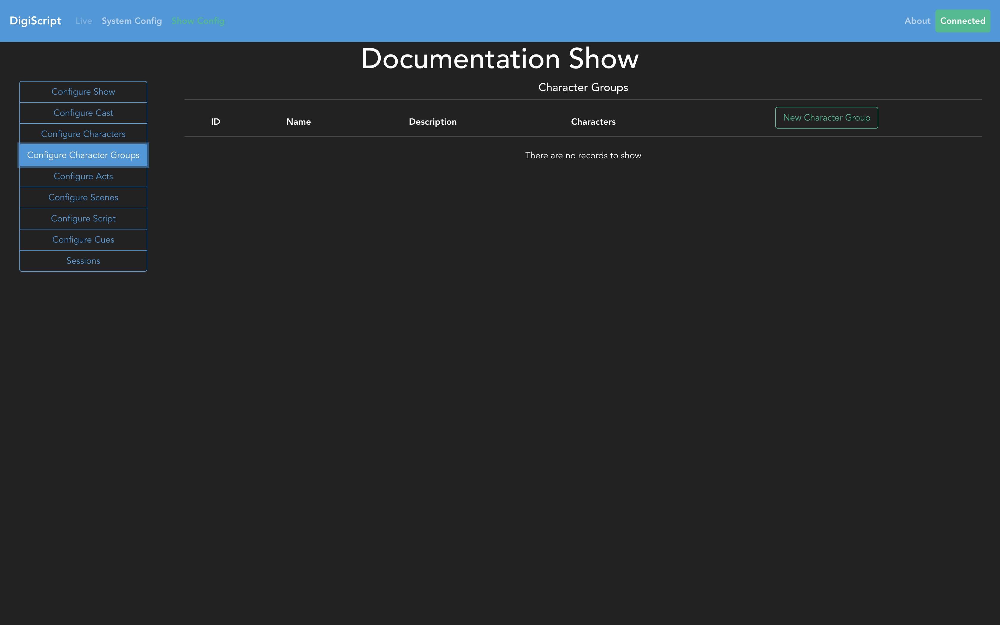

## Configuring a Show

### Cast, Characters and Character Groups

The first thing a show needs is a cast! The **Configure Cast** tab on the left hand side will take
you to the place to configure your cast.

From here, you can Add, Edit and Delete cast members.

Once the cast has been configured, the next step is to go to the **Configure Characters** tab to start
inputting details about the show's characters.

Here, you can Add, Edit and Delete characters as exampled below. When creating a character, you can
optionally reference the cast member that they are played by.

The final part of cast and character configuration is to configure any character groups. This is
conceptually just a group of characters that may all have the same lines in a song for example, 
where the script does not display each individual name. Going to the **Configure Character Groups**
tab allows you to do this.

When creating a character group, you can optionally assign characters to this group. The reason for
this being optional is that you can choose to use the character groups to represent the Chorus for 
example, as this is not usually comprised of named characters.

