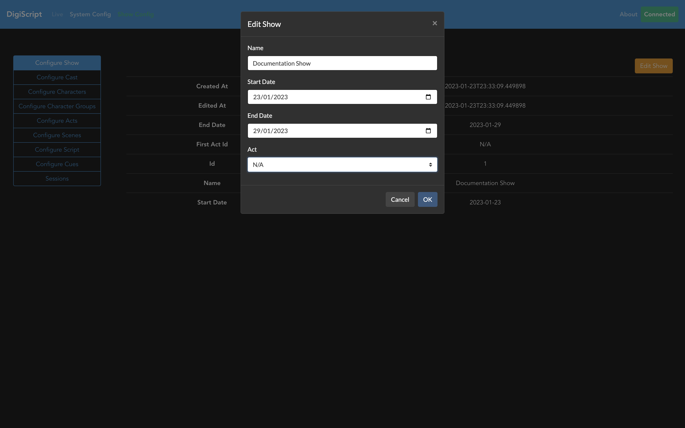

## Configuring a Show

### Setting the First Act

Finally, once all the acts and scenes are created, and the correct ordering of these specified, the
final task is to go back to the **Configure Show** tab, and use the *Edit Show* option to configure the
first act of the show.

This final step ensures that there is the correct ordering of acts and scenes within those acts, to
ensure that the script can be properly set up.