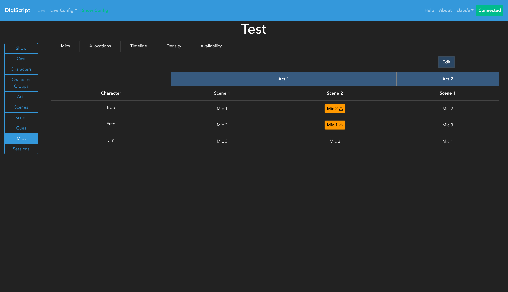
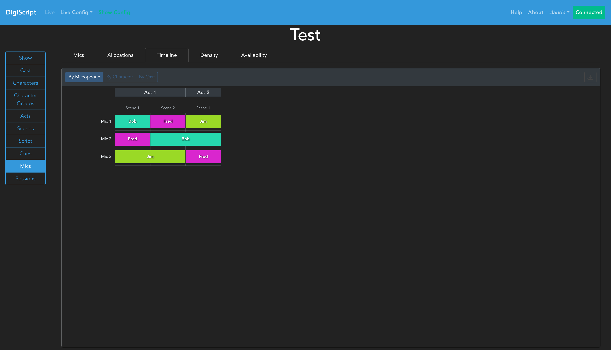
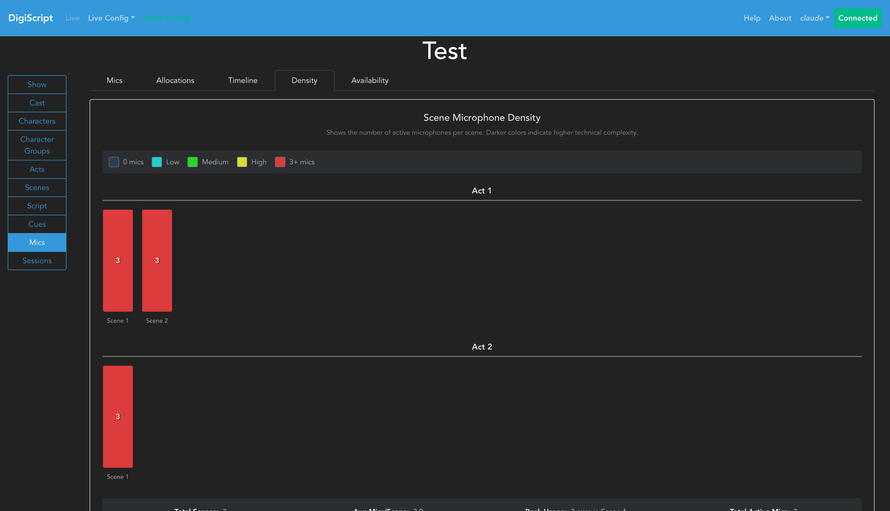
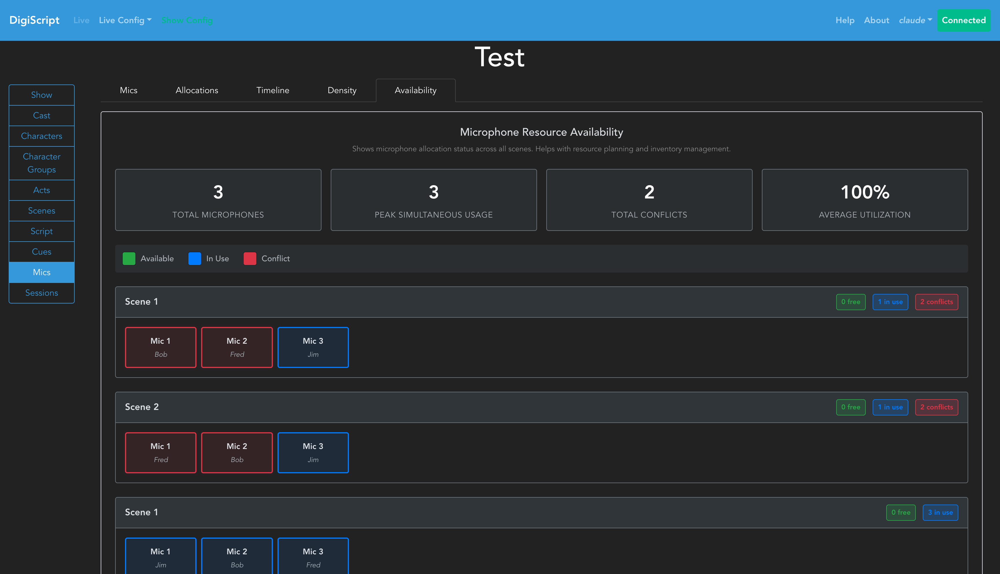

## Configuring a Show

### Microphone and Microphone Allocations

Once Characters, Acts and Scenes have been configured, you can optionally choose to configure microphones used throughout the show and assign them to characters. This is done from the **Mics** tab in the **Show Config** page.

#### Setting Up Microphones

Navigating to the **Mics** tab will initially show an empty microphone list:

Click the **Add** button to create a new microphone. Each microphone must have a unique name for the show. After adding microphones, they will appear in the microphones overview:

You can use the **Edit** and **Delete** buttons to manage existing microphones.

#### Configuring Microphone Allocations

Once microphones have been created, you can configure their allocations by going to the **Allocations** tab. This displays a matrix showing each character against each scene in the show:

To assign a microphone to a character, follow these steps:

1. **Select a microphone** from the dropdown box at the top of the page
2. The table will update to show the allocation view for that microphone:

3. **Click on individual cells** in the matrix to allocate or de-allocate the selected microphone to a character for that specific scene
4. Cells will highlight to show where the microphone is currently allocated:

#### Allocation Constraints

- You **cannot** allocate the same microphone to multiple characters in the same scene
  - This reflects the physical constraint that one microphone can only be worn by one person at a time

#### Multiple Microphones Per Character

DigiScript supports assigning multiple microphones to a single character in a scene. This is useful for:

- **Primary + Backup Configuration**: Lead characters who aren't offstage long enough to swap out microphone packs can have both a primary and backup microphone assigned
- **Redundancy**: Ensuring continuity in case of technical failures during performance
- **Technical Flexibility**: Accommodating different microphone types or configurations for the same character

To assign multiple microphones to a character:
1. Select the first microphone from the dropdown and allocate it to the character
2. Select the second microphone from the dropdown and allocate it to the same character
3. The character will now show both microphones in the view mode (e.g., "Mic 1, Mic 2")

In the Timeline view, characters with multiple microphones will display stacked bars showing all assigned microphones with consistent color-coding.

#### Saving Allocations

After making your allocations, click the **Save** button to confirm your changes. Once saved, the table will display the final allocation showing which microphone is assigned to which character in each scene:

The saved view provides a clear overview of microphone usage throughout the entire show, helping sound engineers plan microphone management and character coverage.

#### Conflict Detection

DigiScript automatically detects potential microphone conflicts when the same microphone is allocated to different characters in adjacent scenes. Conflicts are tracked individually per microphone - a character with multiple microphones may have conflicts on some mics but not others. Conflicts are highlighted in the allocations matrix to alert you to quick-changes that may require attention:

- **Orange highlights** indicate conflicts within the same act (tight changeover required)
- **Blue highlights** indicate conflicts across act boundaries (interval provides changeover time)

Hovering over a highlighted allocation shows:
- The full list of microphones assigned to that character in that scene
- Details about which specific microphones have conflicts
- Information about which scenes and characters are involved in each conflict

When a character has multiple microphones, the tooltip will clearly indicate which microphone(s) have conflicts, allowing you to plan changeovers for specific microphones while others remain assigned.

### Microphone Timeline View

The **Timeline** tab provides a visual representation of microphone allocations across all scenes in the show. This view helps you understand allocation patterns and identify conflicts at a glance.

#### Timeline Features

- **View Modes**: Switch between three different perspectives:
  - **By Microphone**: Shows which characters use each microphone across scenes
  - **By Character**: Shows which microphones each character uses across scenes
  - **By Cast**: Shows microphone usage grouped by cast member

- **Visual Layout**: The timeline uses color-coded bars to represent allocations:
  - Each row represents a microphone, character, or cast member (depending on view mode)
  - Each column represents a scene in the show
  - Acts are labeled at the top for easy reference
  - Colored bars show continuous allocations (same entity across multiple scenes)

- **Export**: Click the download button to export the timeline as a PNG image for documentation or planning purposes

#### Using the Timeline

1. Select your preferred view mode using the buttons at the top
2. Scroll horizontally to see all scenes in large shows
3. Click on allocation bars to see detailed information
4. Colors are automatically assigned to distinguish different entities

### Scene Density Heatmap

The **Density** tab visualizes technical complexity by showing how many microphones are active in each scene. This helps identify technically demanding scenes that may require additional crew or planning.

#### Heatmap Features

- **Color Gradient**: Scenes are color-coded from blue (low mic count) to red (high mic count)
- **Act Grouping**: Scenes are organized by act for easy reference
- **Scene Statistics**: Displays total scenes, average mics per scene, peak usage, and total active mics
- **Interactive Bars**: Click on scene bars to see detailed information

#### Interpreting the Heatmap

- Darker red scenes require more microphones and may be more technically complex
- Blue scenes with fewer microphones may be simpler to manage
- Use peak usage information to ensure you have enough microphone inventory
- Identify scenes that may require additional sound crew attention

### Resource Availability Dashboard

The **Availability** tab provides a comprehensive overview of microphone resource planning across the entire show. This view helps with inventory management and resource allocation.

#### Dashboard Features

- **Summary Statistics**:
  - Total microphones in inventory
  - Peak simultaneous usage (maximum mics needed at once)
  - Total conflicts detected across the show
  - Average utilization rate (percentage of mic inventory in use)

- **Scene-by-Scene Breakdown**: For each scene, see:
  - Number of available microphones (not in use)
  - Number of microphones in use
  - Number of conflicts requiring attention

- **Microphone Status Grid**: Color-coded cards show the status of each microphone in each scene:
  - **Green**: Microphone is available (not allocated)
  - **Blue**: Microphone is in use by a character
  - **Red (pulsing)**: Microphone has a conflict with adjacent scenes

#### Using the Availability Dashboard

1. Review summary statistics to ensure sufficient microphone inventory
2. Check the utilization rate to identify over or under-provisioning
3. Scan the scene-by-scene breakdown for scenes with conflicts
4. Click on microphone cards to see detailed allocation information
5. Use conflict indicators to identify scenes requiring changeover planning
