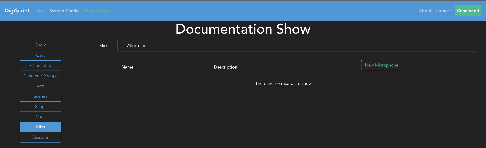
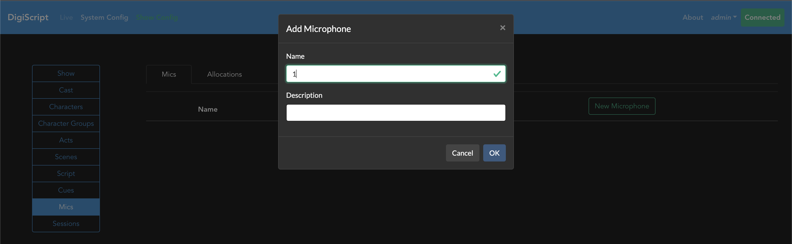
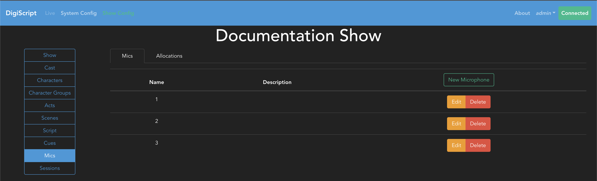
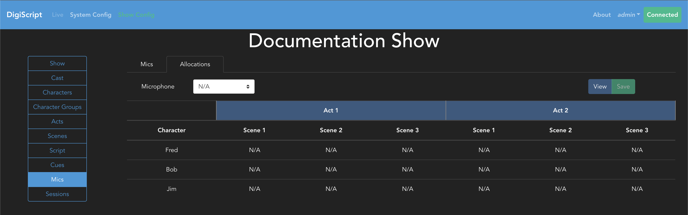
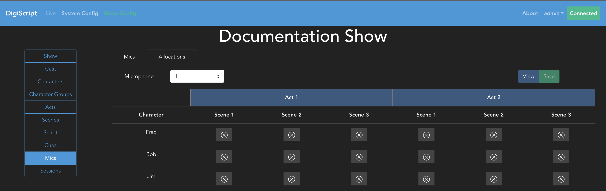
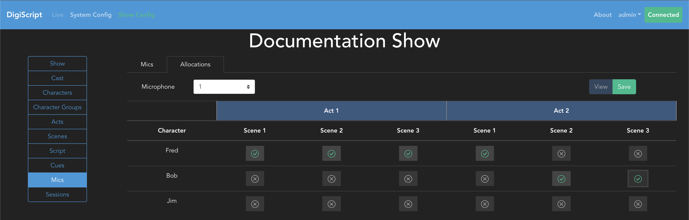
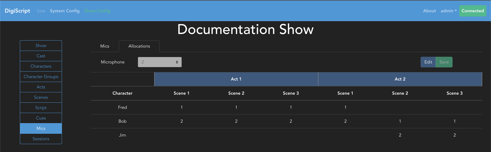

## Configuring a Show

### Microphone and Microphone Allocations

Once Characters, Acts and Scenes have been configured, you can optionally choose to configure
microphones used through the show, and assign them to characters too. This is done from the **Mics**
tab in the **Show Config** page. Navigating to this tab will bring up a view like the following:

From here you can Add, Edit and Delete microphones. Each microphone must also have a unique name 
for a given show.

Once the microphones have been added, you can then configure their allocations by going to the
**Allocations** tab. This displays a matrix of each character against each scene in the show, as
shown here:

In order to assign a microphone to a character, first select the microphone from the dropdown box
and then the table will update to show you the allocation view:

From here, clicking on each cell will either allocate, or de-allocate, the microphone selected to
the character selected for that scene. You cannot allocate the same microphone to multiple 
characters in the same scene, or allocate multiple microphones to a single character for a given
scene.

In this example, we have allocated microphone 1 and 2 to characters at different points in the
show:

After making your allocations, press the **Save** button to confirm your changes.

Finally, you can view the allocation for the show as a whole by pressing the **Save** button and
this will update the table to show which microphone is assigned to which character and in which
scene:

