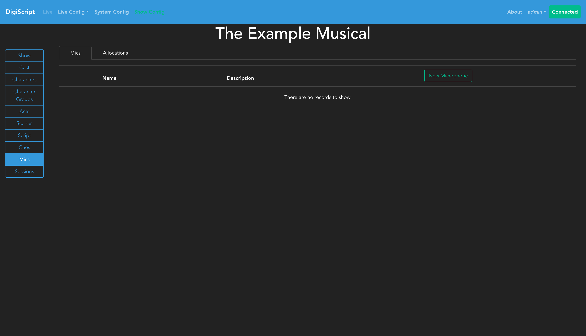
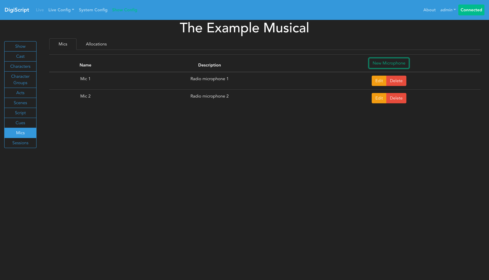
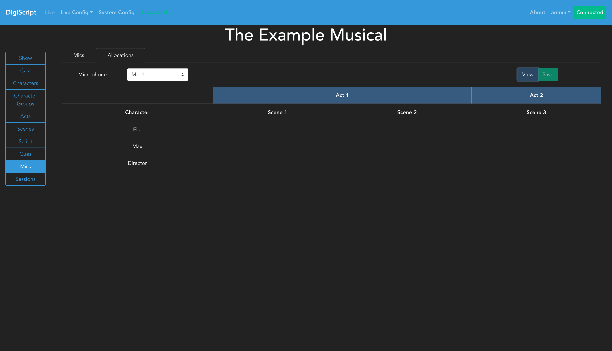
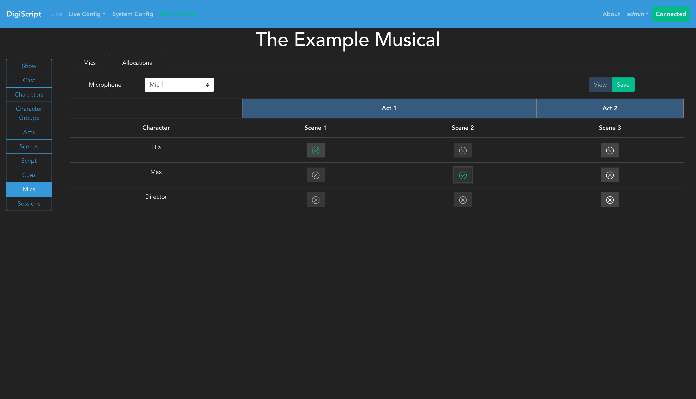

## Configuring a Show

### Microphone and Microphone Allocations

Once Characters, Acts and Scenes have been configured, you can optionally choose to configure microphones used throughout the show and assign them to characters. This is done from the **Mics** tab in the **Show Config** page.

#### Setting Up Microphones

Navigating to the **Mics** tab will initially show an empty microphone list:

Click the **Add** button to create a new microphone. Each microphone must have a unique name for the show. After adding microphones, they will appear in the microphones overview:

You can use the **Edit** and **Delete** buttons to manage existing microphones.

#### Configuring Microphone Allocations

Once microphones have been created, you can configure their allocations by going to the **Allocations** tab. This displays a matrix showing each character against each scene in the show:

To assign a microphone to a character, follow these steps:

1. **Select a microphone** from the dropdown box at the top of the page
2. The table will update to show the allocation view for that microphone:

3. **Click on individual cells** in the matrix to allocate or de-allocate the selected microphone to a character for that specific scene
4. Cells will highlight to show where the microphone is currently allocated:

#### Allocation Constraints

- You **cannot** allocate the same microphone to multiple characters in the same scene
- You **cannot** allocate multiple microphones to a single character for a given scene
- These constraints ensure practical microphone management during live shows

#### Saving Allocations

After making your allocations, click the **Save** button to confirm your changes. Once saved, the table will display the final allocation showing which microphone is assigned to which character in each scene:

The saved view provides a clear overview of microphone usage throughout the entire show, helping sound engineers plan microphone management and character coverage.
