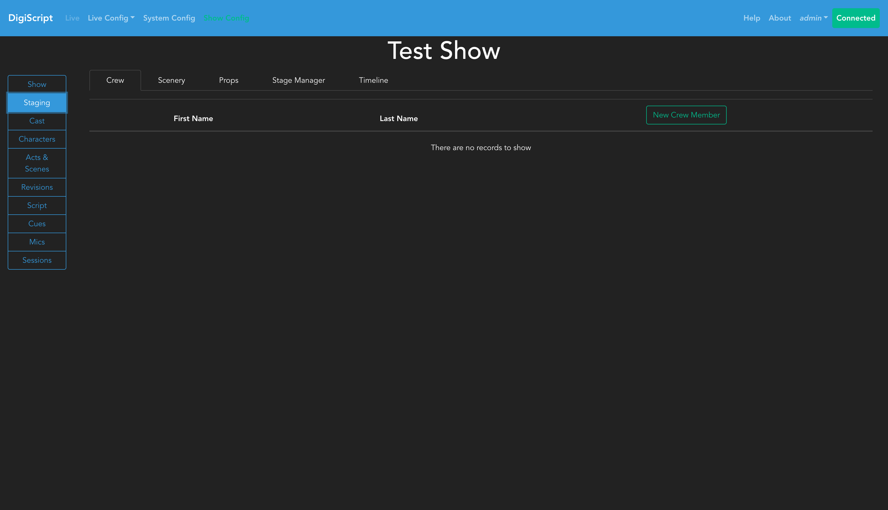
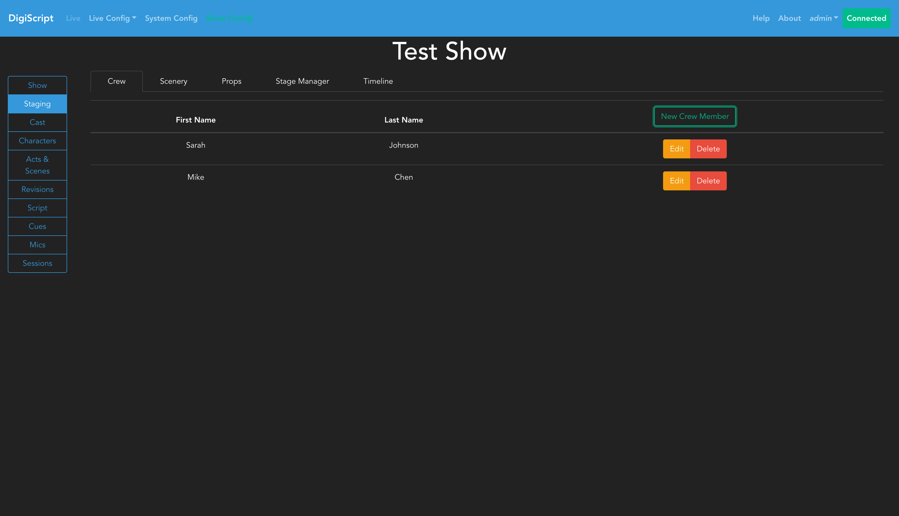
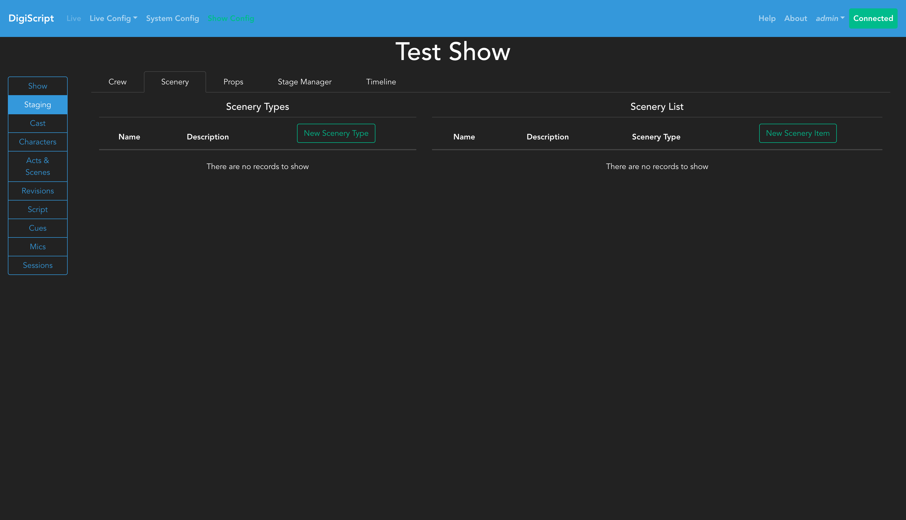
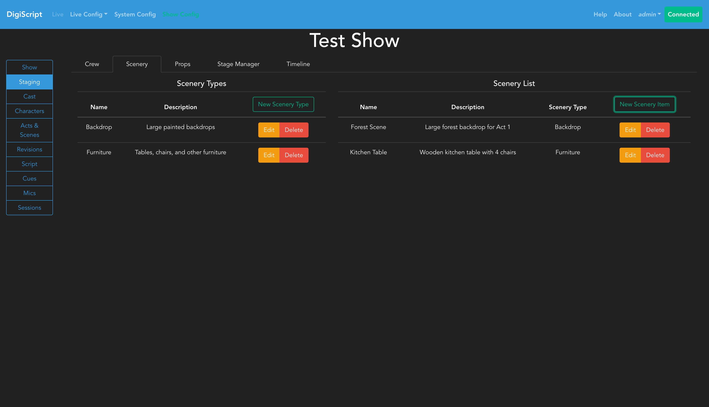
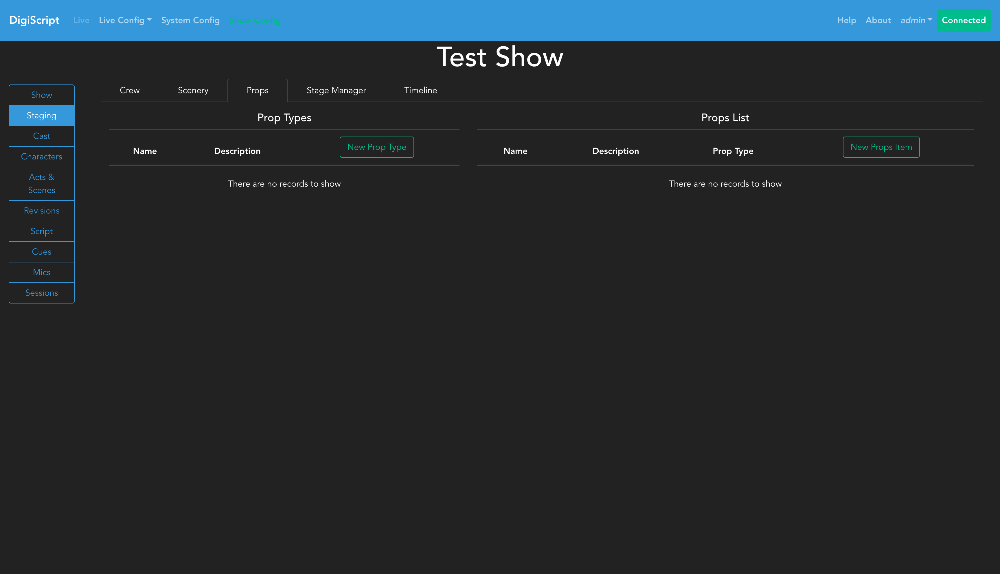
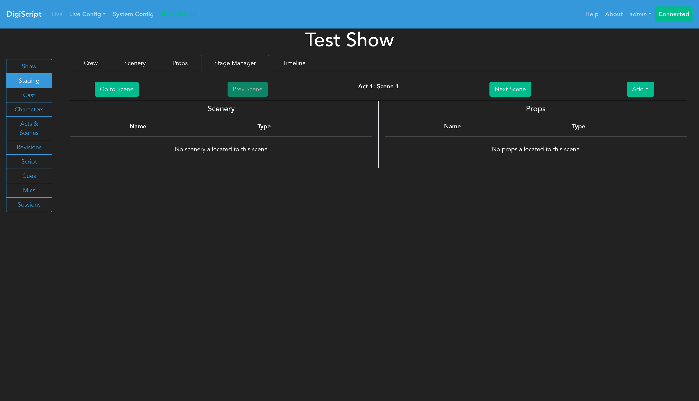
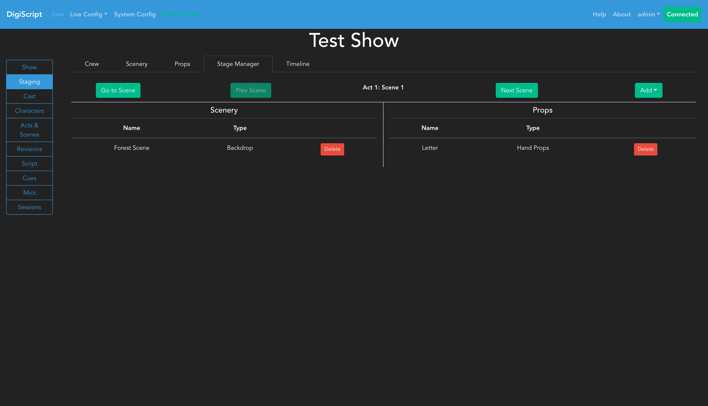
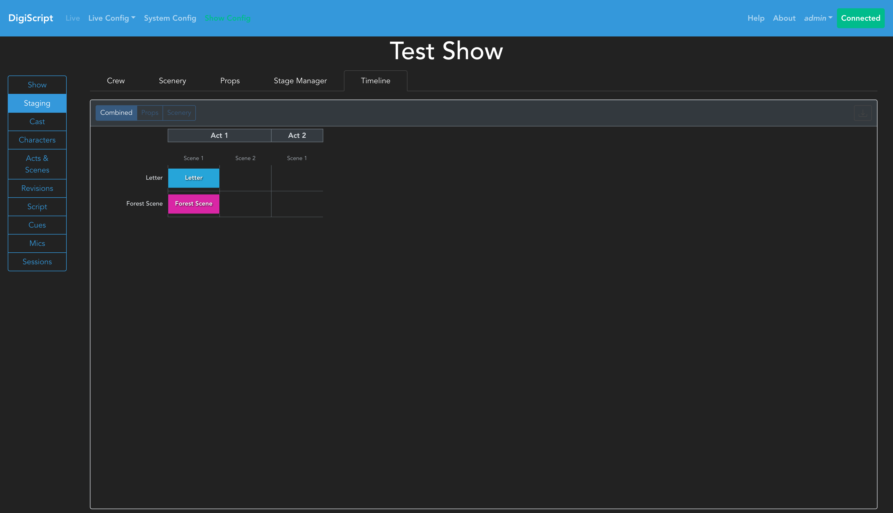

## Configuring a Show

### Stage Management

Once Characters, Acts and Scenes have been configured, you can optionally configure stage management features including crew members, props, and scenery. This is done from the **Staging** tab in the **Show Config** page.

The Staging section provides five tabs for managing different aspects of your production:

- **Crew**: Manage crew member names
- **Scenery**: Define scenery types and items
- **Props**: Define prop types and items
- **Stage Manager**: Allocate props and scenery to specific scenes
- **Timeline**: Visualize allocations across the entire show

#### Managing Crew Members

The **Crew** tab allows you to maintain a list of crew members for your production:

Click the **New Crew Member** button to add crew members. Each crew member has a first name and last name:

You can use the **Edit** and **Delete** buttons to manage existing crew members.

#### Managing Scenery

The **Scenery** tab is divided into two sections: Scenery Types and Scenery List.

**Scenery Types** allow you to categorize your scenery items (e.g., "Backdrop", "Furniture", "Set Pieces"). To create a scenery type:

1. Click **New Scenery Type**
2. Enter a name and optional description
3. Click **OK**

**Scenery List** contains the actual scenery items used in your production. To add a scenery item:

1. Click **New Scenery Item**
2. Select a scenery type from the dropdown
3. Enter a name and optional description
4. Click **OK**

#### Managing Props

The **Props** tab follows the same structure as Scenery, with Prop Types and a Props List:

**Prop Types** allow you to categorize your props (e.g., "Hand Props", "Set Dressing", "Consumables"). To create a prop type:

1. Click **New Prop Type**
2. Enter a name and optional description
3. Click **OK**

**Props List** contains the actual prop items. To add a prop:

1. Click **New Props Item**
2. Select a prop type from the dropdown
3. Enter a name and optional description
4. Click **OK**

#### Stage Manager - Scene Allocations

The **Stage Manager** tab provides a scene-by-scene interface for allocating props and scenery to specific scenes:

The interface shows:
- **Scene navigation**: Use the **Prev Scene** and **Next Scene** buttons to move between scenes, or click **Go to Scene** to jump to a specific scene
- **Current scene display**: Shows which act and scene you're currently viewing
- **Scenery section**: Lists all scenery allocated to the current scene
- **Props section**: Lists all props allocated to the current scene

To allocate items to a scene:

1. Navigate to the desired scene
2. Click the **Add** dropdown button
3. Select either **Scenery** or **Prop**
4. Choose the item from the dropdown
5. Click **OK**

To remove an allocation, click the **Delete** button next to the item.

**Note**: Each prop or scenery item can only be allocated to one scene at a time, reflecting the physical constraint that an item can only be in one place.

#### Stage Timeline

The **Timeline** tab provides a visual overview of all props and scenery allocations across the entire show:

##### Timeline Features

- **View Modes**: Switch between three different perspectives using the buttons at the top:
  - **Combined**: Shows both props and scenery in a single view
  - **Props**: Shows only prop allocations
  - **Scenery**: Shows only scenery allocations

- **Visual Layout**: The timeline uses color-coded bars to represent allocations:
  - Each row represents a prop or scenery item
  - Each column represents a scene in the show
  - Acts are labeled at the top for easy reference
  - Colored bars show where each item is allocated

- **Export**: Click the download button to export the timeline as a PNG image for documentation or planning purposes

##### Using the Timeline

1. Select your preferred view mode using the buttons at the top
2. Scroll horizontally to see all scenes in large shows
3. Use the timeline to identify:
   - Which scenes have the most items
   - Which items are used in which scenes
   - Potential conflicts or busy changeover points

##### Crew Timeline

The **Timeline** tab includes a **Crew** sub-tab (navigate to **Timeline** → **Crew**) that displays a crew-centric visual grid showing all SET and STRIKE assignments across the show:

- **Rows** represent crew members (only those with at least one assignment are shown)
- **Columns** represent scenes, grouped by act
- **Bars** are color-coded by the prop or scenery item, with **▲** for SET and **▼** for STRIKE
- When a crew member has multiple assignments in the same scene, bars stack vertically

###### Conflict Indicators

The timeline highlights potential scheduling problems based on **distinct items** — SET and STRIKE of the same item in a scene is the normal lifecycle and is not treated as a conflict:

- **Red border** (hard conflict): A crew member is assigned to **two or more different items** in the same scene (e.g., SET Chair + SET Table)
- **Orange dashed border** (soft conflict): A crew member has assignments in adjacent scenes within the same act involving **different items**, which may leave insufficient changeover time (e.g., SET Chair in Scene 1 + SET Table in Scene 2). If both scenes involve exactly the same items, no soft conflict is raised.

Act boundaries are not treated as soft conflicts, since intermissions provide natural gaps.

Click the **Export** button to save the crew timeline as a PNG image.