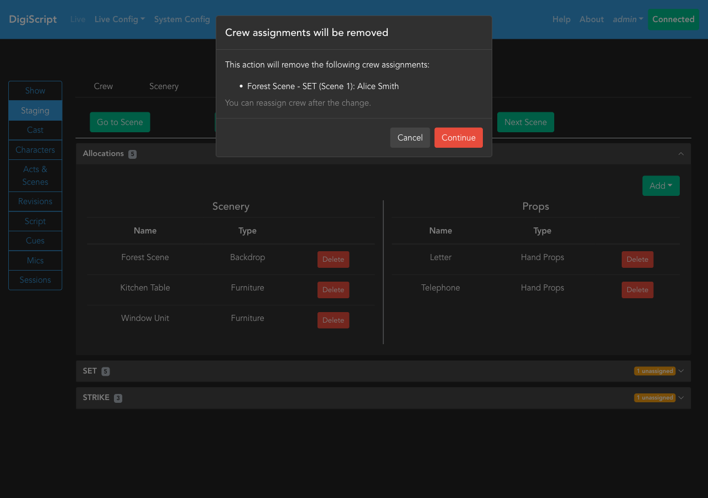
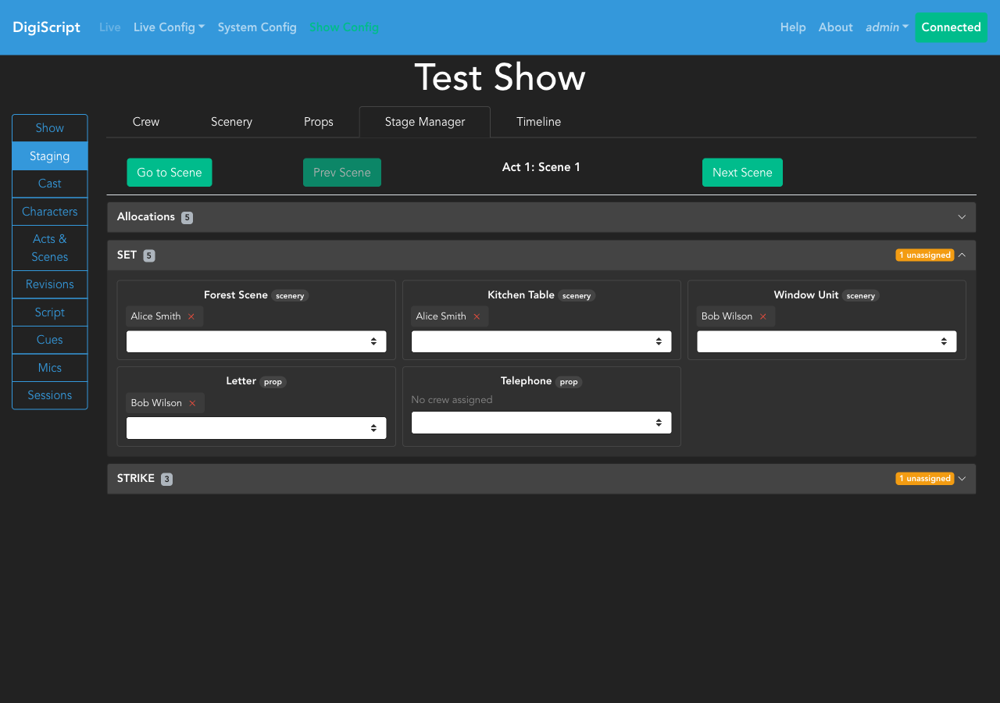
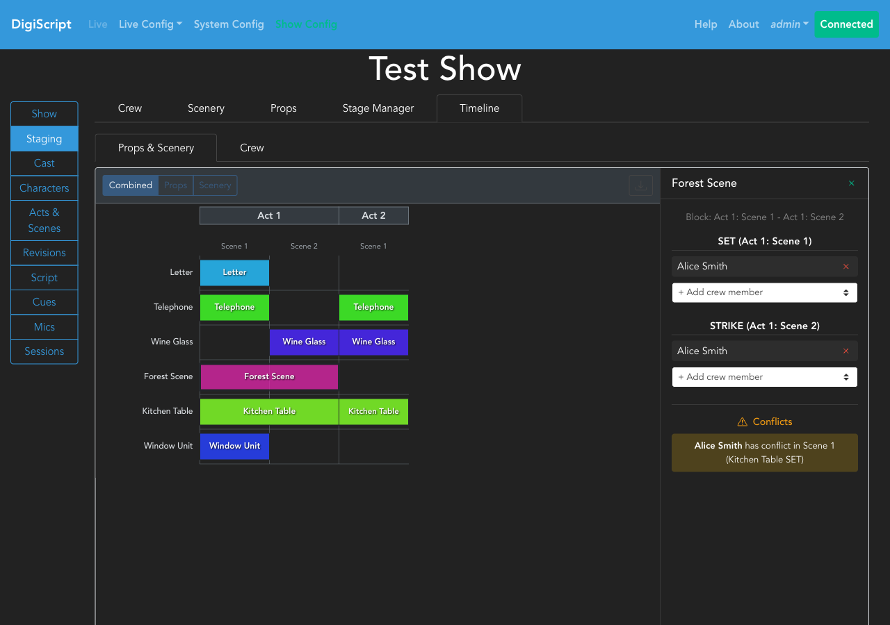
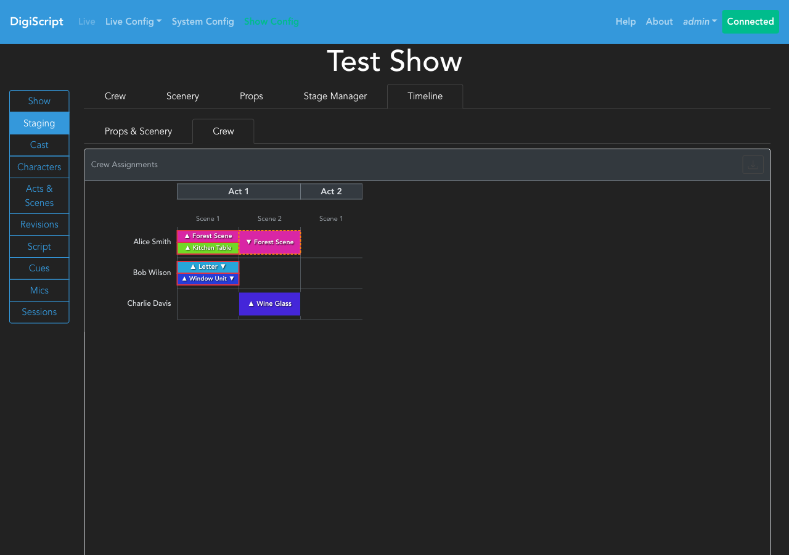

## Configuring a Show

### Stage Management

Once Characters, Acts and Scenes have been configured, you can optionally configure stage management features including crew members, props, and scenery. This is done from the **Staging** tab in the **Show Config** page.

The Staging section provides five tabs for managing different aspects of your production:

- **Crew**: Manage crew member names
- **Scenery**: Define scenery types and items
- **Props**: Define prop types and items
- **Stage Manager**: Allocate props and scenery to specific scenes
- **Timeline**: Visualize allocations across the entire show

#### Managing Crew Members

The **Crew** tab allows you to maintain a list of crew members for your production:

Click the **New Crew Member** button to add crew members. Each crew member has a first name and last name:

You can use the **Edit** and **Delete** buttons to manage existing crew members.

#### Managing Scenery

The **Scenery** tab is divided into two sections: Scenery Types and Scenery List.

**Scenery Types** allow you to categorize your scenery items (e.g., "Backdrop", "Furniture", "Set Pieces"). To create a scenery type:

1. Click **New Scenery Type**
2. Enter a name and optional description
3. Click **OK**

**Scenery List** contains the actual scenery items used in your production. To add a scenery item:

1. Click **New Scenery Item**
2. Select a scenery type from the dropdown
3. Enter a name and optional description
4. Click **OK**

#### Managing Props

The **Props** tab follows the same structure as Scenery, with Prop Types and a Props List:

**Prop Types** allow you to categorize your props (e.g., "Hand Props", "Set Dressing", "Consumables"). To create a prop type:

1. Click **New Prop Type**
2. Enter a name and optional description
3. Click **OK**

**Props List** contains the actual prop items. To add a prop:

1. Click **New Props Item**
2. Select a prop type from the dropdown
3. Enter a name and optional description
4. Click **OK**

#### Understanding Allocation Blocks

When a prop or scenery item is allocated to consecutive scenes within the same act, those scenes form an **allocation block**. Blocks are the foundation for crew assignments — crew members are assigned to the boundaries of each block:

- **SET boundary**: The first scene of the block, where the item needs to be brought on stage
- **STRIKE boundary**: The last scene of the block, where the item needs to be removed from stage

If a block contains only a single scene, both SET and STRIKE occur on that same scene.

Blocks never span act boundaries. If a Kitchen Table is allocated to Act 1 Scenes 1-2 and Act 2 Scene 1, it forms two separate blocks: one for Act 1 (SET at Scene 1, STRIKE at Scene 2) and one for Act 2 (SET and STRIKE both at Scene 1).

Understanding blocks helps you interpret the Stage Manager's SET and STRIKE cards and the Timeline's side panel, both of which organise crew assignments around block boundaries.

#### Stage Manager - Scene Allocations

The **Stage Manager** tab provides a scene-by-scene interface for allocating props and scenery to specific scenes:

The interface shows:
- **Scene navigation**: Use the **Prev Scene** and **Next Scene** buttons to move between scenes, or click **Go to Scene** to jump to a specific scene
- **Current scene display**: Shows which act and scene you're currently viewing
- **Scenery section**: Lists all scenery allocated to the current scene
- **Props section**: Lists all props allocated to the current scene

To allocate items to a scene:

1. Navigate to the desired scene
2. Click the **Add** dropdown button
3. Select either **Scenery** or **Prop**
4. Choose the item from the dropdown
5. Click **OK**

To remove an allocation, click the **Delete** button next to the item.

**Note**: Each prop or scenery item can only be allocated to one scene at a time, reflecting the physical constraint that an item can only be in one place.

##### Crew Assignment Warnings

When adding or removing an allocation that changes the boundaries of an allocation block, any crew assignments on the affected boundaries will be removed. A warning dialog will appear listing the specific crew assignments that will be affected, giving you the opportunity to cancel or proceed.

For example, if a chair is allocated to Scenes 1-3 with Alice assigned to SET (Scene 1), removing Scene 1's allocation shifts the SET boundary to Scene 2. The warning dialog will list "Chair - SET (Scene 1): Alice" as an assignment that will be removed. After proceeding, you can reassign crew to the new boundaries.

##### Assigning Crew to Items

Below the Allocations card, the Stage Manager displays **SET** and **STRIKE** collapsible cards when the current scene has block boundary items:

- **SET** shows items that are new to the current scene (need to be brought on stage)
- **STRIKE** shows items that are leaving after the current scene (need to be removed)

Each card header displays the total number of items and an **unassigned count** badge if any items lack crew. Click the card header to expand it.

Inside each card, every boundary item is shown with:
- The item name and a **type badge** (scenery or prop)
- Any currently assigned crew members, each with a **×** button to remove
- A dropdown to add additional crew members

To assign crew to an item:
1. Expand the **SET** or **STRIKE** card
2. Find the item you want to assign crew to
3. Select a crew member from the dropdown
4. The crew member appears immediately — no save button needed

To remove a crew assignment, click the **×** button next to the crew member's name.

#### Stage Timeline

The **Timeline** tab provides a visual overview of all props and scenery allocations across the entire show:

##### Timeline Features

- **View Modes**: Switch between three different perspectives using the buttons at the top:
  - **Combined**: Shows both props and scenery in a single view
  - **Props**: Shows only prop allocations
  - **Scenery**: Shows only scenery allocations

- **Visual Layout**: The timeline uses color-coded bars to represent allocations:
  - Each row represents a prop or scenery item
  - Each column represents a scene in the show
  - Acts are labeled at the top for easy reference
  - Colored bars show where each item is allocated

- **Export**: Click the download button to export the timeline as a PNG image for documentation or planning purposes

##### Using the Timeline

1. Select your preferred view mode using the buttons at the top
2. Scroll horizontally to see all scenes in large shows
3. Use the timeline to identify:
   - Which scenes have the most items
   - Which items are used in which scenes
   - Potential conflicts or busy changeover points

##### Assigning Crew Using the Timeline

Click any allocation bar on the timeline to open a **side panel** showing the block details and crew assignment controls:

The side panel displays:
- The **item name** at the top, with a **×** button to close the panel
- The **block scene range** (e.g., "Act 1: Scene 1 - Act 1: Scene 2")
- A **SET** section showing the SET boundary scene and assigned crew
- A **STRIKE** section showing the STRIKE boundary scene and assigned crew
- A **Conflicts** section at the bottom if the assigned crew have scheduling conflicts with other items in the same scene

Each section has a dropdown to add crew members and **×** buttons to remove existing assignments. Hovering over a bar highlights it with an outline; clicking selects it and opens the panel. Click a different bar to switch, or click **×** to close.

##### Crew Timeline

The **Timeline** tab includes a **Crew** sub-tab (navigate to **Timeline** → **Crew**) that displays a crew-centric visual grid showing all SET and STRIKE assignments across the show:

- **Rows** represent crew members (only those with at least one assignment are shown)
- **Columns** represent scenes, grouped by act
- **Bars** are color-coded by the prop or scenery item, with **▲** for SET and **▼** for STRIKE
- When a crew member has multiple assignments in the same scene, bars stack vertically

###### Conflict Indicators

The timeline highlights potential scheduling problems based on **distinct items** — SET and STRIKE of the same item in a scene is the normal lifecycle and is not treated as a conflict:

- **Red border** (hard conflict): A crew member is assigned to **two or more different items** in the same scene (e.g., SET Chair + SET Table)
- **Orange dashed border** (soft conflict): A crew member has assignments in adjacent scenes within the same act involving **different items**, which may leave insufficient changeover time (e.g., SET Chair in Scene 1 + SET Table in Scene 2). If both scenes involve exactly the same items, no soft conflict is raised.

Act boundaries are not treated as soft conflicts, since intermissions provide natural gaps.

Click the **Export** button to save the crew timeline as a PNG image.

#### Recommended Workflow

The Stage Manager, Timeline, and Crew Timeline tabs work together to support a three-phase crew assignment workflow:

1. **Planning**: Use the Stage Manager's SET/STRIKE cards or the Timeline's side panel to assign crew members to block boundaries. The Stage Manager is best for working scene-by-scene, while the Timeline side panel is useful for seeing the full block context at a glance.
2. **Review**: Switch to the Crew Timeline to verify workload balance across crew members and check for conflicts (red or orange borders). Export the crew timeline for offline review or printing.
3. **Live Show**: During the performance, the Plan modal in the live show view displays crew names beneath each item, giving the stage management team a quick reference without leaving the live page.

#### Plan Modal (Live Show View)

During a live show, the Stage Manager pane's **Plan** button opens a modal showing what items are being set and struck for a given scene. When crew members have been assigned to SET or STRIKE operations, their names appear in italics beneath each item in the Plan modal.

This allows stage crew to quickly see who is responsible for each item during scene changes without navigating away from the live show view. Items with no crew assigned show no additional text.