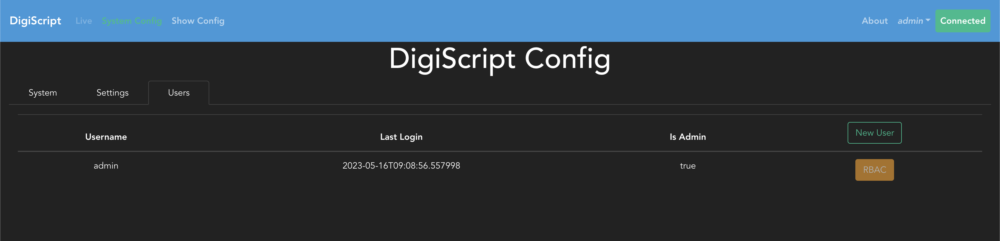
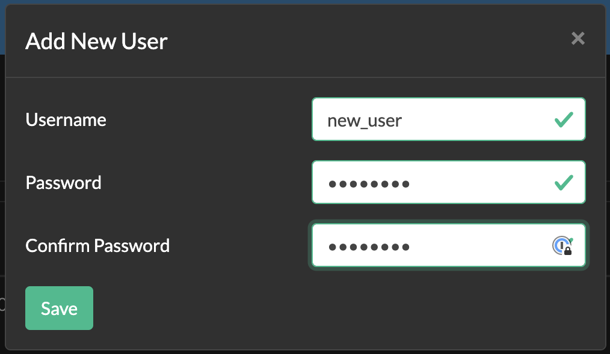
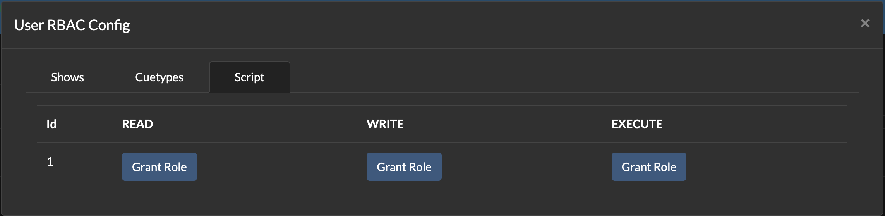

## Users and RBAC

DigiScript allows you to create users per-show, and configure Role Based Authorisation (RBAC) for 
them. This is an optional feature and does not have to be used, the `admin` user created during
application first launch has the permissions to perform all actions, and can be used solely to 
administer the DigiScript application. However, adding users will allow others to perform actions
such as configuring the show and script, or adding new cues.

To configure users, a show must first be loaded. Once this has been done, as the `admin` user you can 
navigate to the **System Config** section page from the top navigation bar, and then to the **Users**
tab within this page. This will show you a table of all users for the current show:

To add a new user, simply click on the `New User` button and enter the details into the form
presented to you:

**Note: the username entered must be unique to the entire system, not per show.**

Once users have been created, their roles can be changed by clicking on the **RBAC** button next
to each user's details. This will bring up the option to configure roles per object per resource,
for example configuring the roles for a particular Cue type.

### RBAC Roles and Mappings

The current RBAC mappings are as follows:

* Shows:
  * Read: Unused
  * Write: Create, edit, delete show resources such as acts, scenes, characters etc
  * Execute: Start and stop show sessions (See [Live Show](./live_show.md))
* Cuetypes:
  * Read: Unused
  * Write: Create, edit and delete cues of a particular type
  * Execute: Unused
* Script:
  * Read: Unused
  * Write: Make changes to the script
  * Execute: Unused