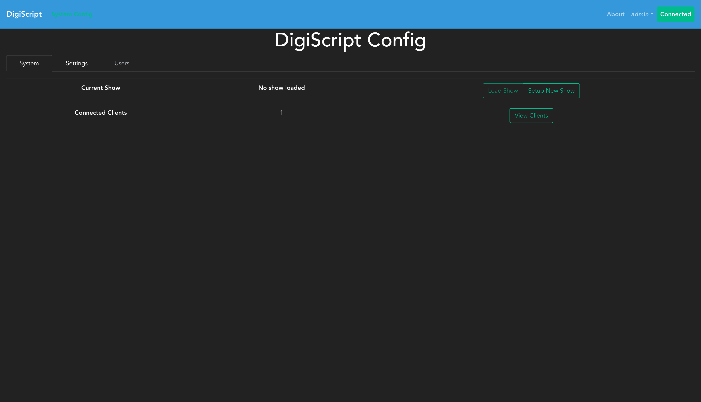
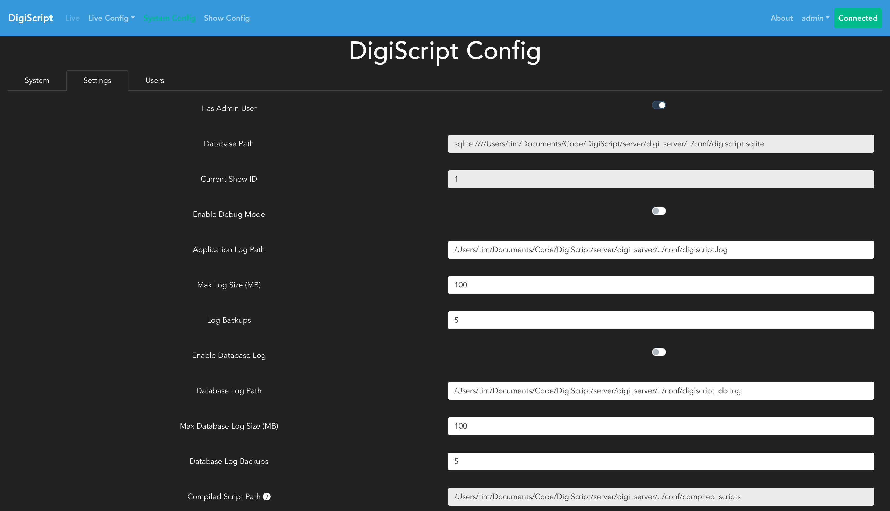
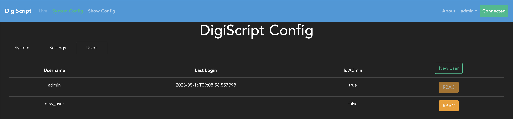

## System Configuration

The **System Config** section, accessible from the top navigation bar, provides system-wide configuration options including user management, RBAC settings, system settings, and show management.

### System Settings

The **Settings** tab allows you to configure system-wide settings that apply across all shows:

These settings control global application behavior and defaults. Settings configured here apply system-wide unless overridden at the user or show level.

### Users and RBAC

DigiScript allows you to create system-wide users and configure Role Based Authorization (RBAC) to control their access to shows and resources. This is an optional feature - the `admin` user created during application first launch has permissions to perform all actions and can be used as the sole administrator. However, adding users allows you to delegate specific permissions for tasks like configuring shows, editing scripts, or managing cues.

#### Managing Users

To configure users, a show must first be loaded. Navigate to the **System Config** page from the top navigation bar, then select the **Users** tab. This displays a table of all system users:

The users table shows:
- Username
- First and Last Name
- Last Seen timestamp (when the user was last active)
- Actions (Edit, Delete, RBAC configuration)

#### Creating Users

Click the **New User** button to add a new user. You'll need to provide:
- Username (must be unique across the entire system)
- Password
- First Name
- Last Name

Users are created at the system level and are not tied to individual shows. Their access to specific shows and resources is controlled through RBAC configuration.

#### Configuring RBAC

Once users have been created, their permissions can be configured by clicking the **RBAC** button next to each user. This opens a detailed permissions interface where you can:
- Grant or revoke access to specific shows
- Set permissions per resource type (e.g., Shows, Scripts, Cue Types)
- Configure fine-grained permissions per specific resource (e.g., write access to lighting cues but not sound cues)

RBAC configuration determines what shows a user can access and what actions they can perform within those shows.

### RBAC Roles and Mappings

The current RBAC mappings are as follows:

* Shows:
  * Read: Unused
  * Write: Create, edit, delete show resources such as acts, scenes, characters etc
  * Execute: Start and stop show sessions (See [Live Show](./live_show.md))
* Cuetypes:
  * Read: Unused
  * Write: Create, edit and delete cues of a particular type
  * Execute: Unused
* Script:
  * Read: Unused
  * Write: Make changes to the script
  * Execute: Unused