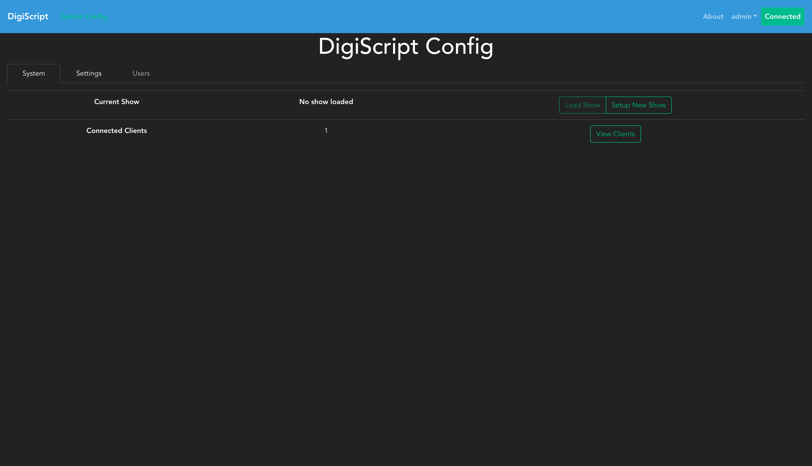
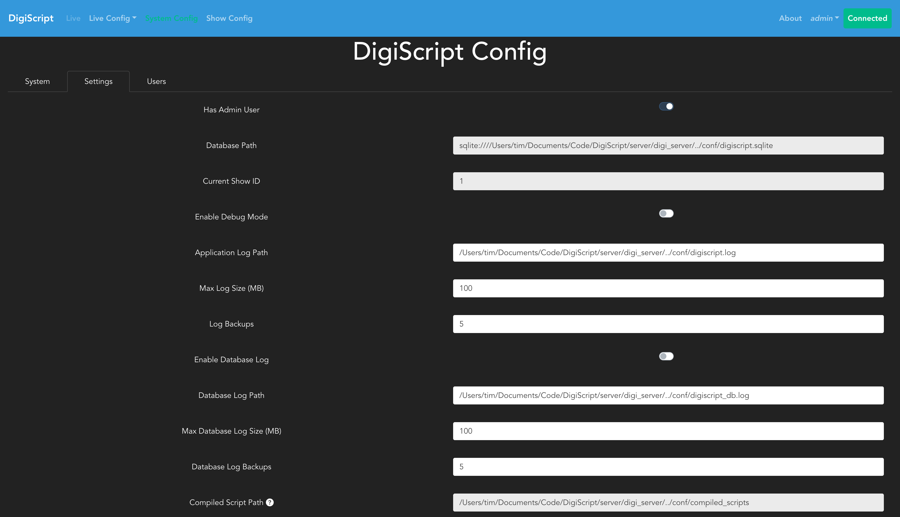
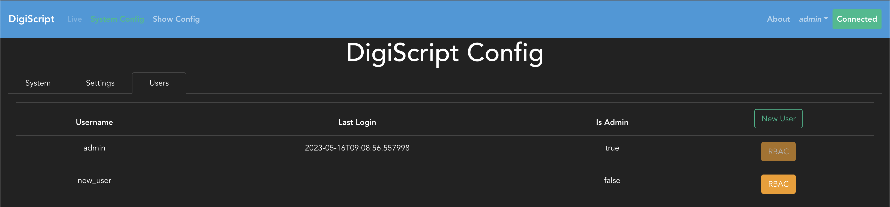

## System Configuration

The **System Config** section, accessible from the top navigation bar, provides system-wide configuration options including user management, RBAC settings, system settings, and show management.

### System Tab

The **System** tab provides an overview of the current system state:

- **Version**: Displays the current DigiScript version and checks for available updates.
- **Connected Clients**: Shows the number of WebSocket clients currently connected to the server. Click "View Clients" to see details about each connected session.
- **Hostname**: The fully-qualified domain name (FQDN) of the server machine.
- **IP Address**: The primary outbound IP address the server is reachable on.
- **Port**: The port the server is listening on.

#### Version Checker

The version checker automatically checks for new DigiScript releases when the server starts, and periodically (every hour) thereafter. The version status shows:

- **Current version**: The version of DigiScript currently running
- **Status badge**: Indicates whether you're up to date (green), an update is available (yellow), or the check failed (red)
- **Latest version**: When an update is available, shows the newest version number with a link to the release notes
- **Last checked**: Timestamp of when the version was last checked

Click the **Check Now** button to manually trigger a version check against the GitHub releases.

### System Settings

The **Settings** tab allows you to configure system-wide settings that apply across all shows:

These settings control global application behavior and defaults. Settings configured here apply system-wide unless overridden at the user or show level.

### Users and RBAC

DigiScript allows you to create system-wide users and configure Role Based Authorization (RBAC) to control their access to shows and resources. This is an optional feature - the `admin` user created during application first launch has permissions to perform all actions and can be used as the sole administrator. However, adding users allows you to delegate specific permissions for tasks like configuring shows, editing scripts, or managing cues.

#### Managing Users

To configure users, a show must first be loaded. Navigate to the **System Config** page from the top navigation bar, then select the **Users** tab. This displays a table of all system users:

The users table shows:
- Username
- First and Last Name
- Last Seen timestamp (when the user was last active)
- Actions (Edit, Delete, RBAC configuration)

#### Creating Users

Click the **New User** button to add a new user. You'll need to provide:
- Username (must be unique across the entire system)
- Password
- First Name
- Last Name

Users are created at the system level and are not tied to individual shows. Their access to specific shows and resources is controlled through RBAC configuration.

#### Editing Users

To change a user's properties, click the **Edit** button next to their row. This opens a modal where you can:

- Toggle the user's account type between **Admin** and **Standard User**

> **Note:** You cannot edit your own account via this interface. Admin status changes take effect immediately — the user's next API request will reflect the updated role.

#### Configuring RBAC

Once users have been created, their permissions can be configured by clicking the **RBAC** button next to each user. This opens a detailed permissions interface where you can:
- Grant or revoke access to specific shows
- Set permissions per resource type (e.g., Shows, Scripts, Cue Types)
- Configure fine-grained permissions per specific resource (e.g., write access to lighting cues but not sound cues)

RBAC configuration determines what shows a user can access and what actions they can perform within those shows.

### Log Viewer

The **Logs** tab (admin only) provides a real-time view of server and client log entries stored in the in-memory log buffer.

#### Sources

- **Server** — Application-level logs from the DigiScript backend: HTTP request access logs, request body debug logs, WebSocket connection events, and general application messages.
- **Client** — Logs forwarded from connected browser clients via the `/api/v1/logs/batch` endpoint.

#### Username Attribution

All log entries are attributed to the logged-in user where one is present:

- **Server logs**: Each HTTP access log line and request-body debug line includes `[username]` in the message (e.g. `200 GET /api/v1/user/settings (127.0.0.1) [alice] 5.23ms`). WebSocket messages and close events also include the username once the connection has been authenticated.
- **Client logs**: The server extracts the username from the JWT token on each batch submission, so all client log entries are attributed even if the client sends no user information itself.

#### Filtering

Use the **Username** filter field to show only entries from a specific user. This filter applies to both Server and Client sources. Combined with the **Level** and **Search** filters, you can quickly isolate activity from a particular user across the full log stream.

### Security Settings

The **Security** category in the Settings tab contains authentication-related configuration.

#### JWT Token Lifetime

Controls how long JWT access tokens remain valid after they are issued. The available options are:

| Option | Duration |
|--------|----------|
| 1 hour | 1 hour |
| 6 hours | 6 hours |
| 12 hours | 12 hours |
| 1 day *(default)* | 24 hours |
| 1 week | 7 days |
| 1 month (30 days) | 30 days |

**Reducing the lifetime** takes effect immediately — any token whose issue time is older than the new limit will be rejected on the next request, even if the token's expiry date has not passed yet. Affected users are redirected to the login page.

**Increasing the lifetime** applies to newly-issued tokens. Active users automatically receive a refreshed token within 30 minutes, at which point the longer lifetime takes effect for their session.

> **Note:** This setting applies to JWT browser session tokens only. API tokens (long-lived keys used for machine-to-machine access) are not subject to this lifetime limit.

### Backup Management

The **Backups** tab allows admin users to view and manage database backup files. DigiScript automatically creates a timestamped copy of the database file before running any database migration, ensuring you can recover data if a migration causes issues.

The tab displays:
- A summary line showing the total number of backups and combined disk usage
- A table listing each backup file with its filename, size, and creation date

To delete a backup, click the **Delete** button next to it and confirm the action. Deletion is permanent and cannot be undone.

> **Note:** Backup files accumulate over time as you upgrade DigiScript. Periodically reviewing and removing old backups helps reclaim disk space once you are confident the corresponding migrations completed successfully.

### RBAC Roles and Mappings

The current RBAC mappings are as follows:

* Shows:
  * Read: Unused
  * Write: Create, edit, delete show resources such as acts, scenes, characters etc
  * Execute: Start and stop show sessions (See [Live Show](./live_show.md))
* Cuetypes:
  * Read: Unused
  * Write: Create, edit and delete cues of a particular type
  * Execute: Unused
* Script:
  * Read: Unused
  * Write: Make changes to the script
  * Execute: Unused