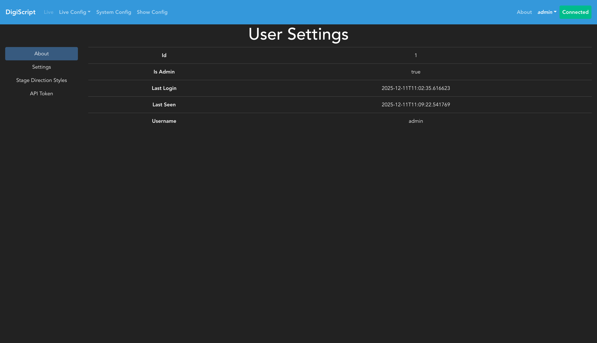
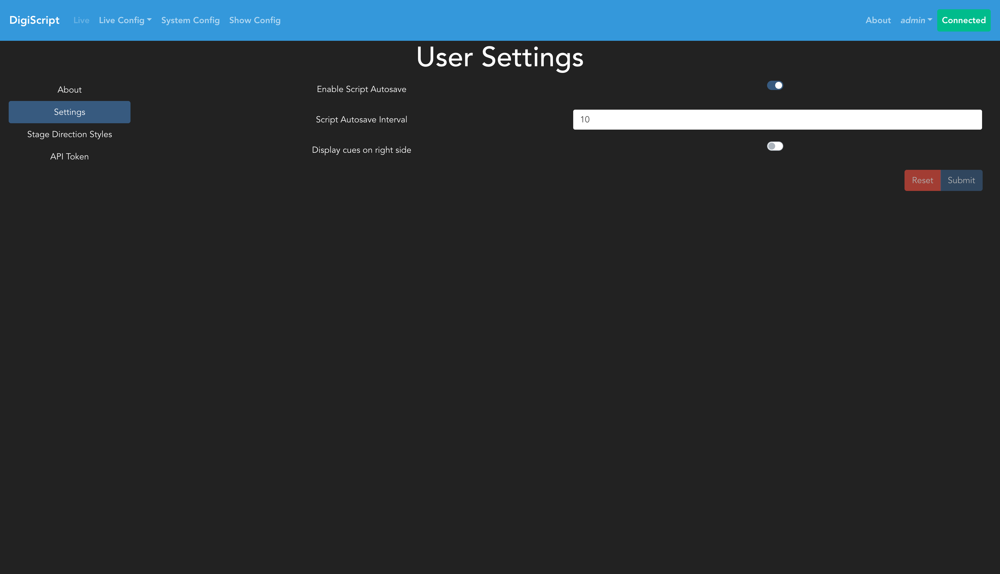
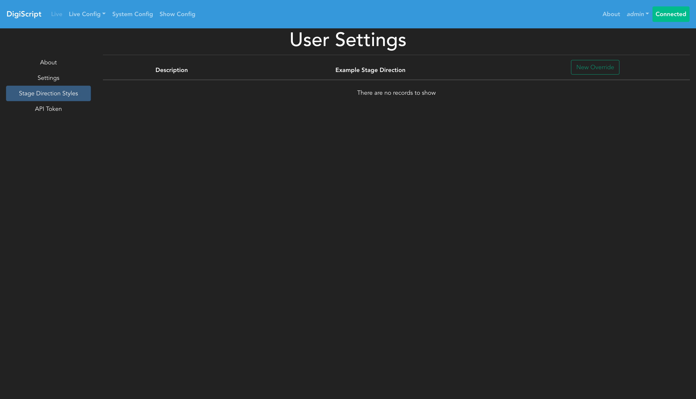
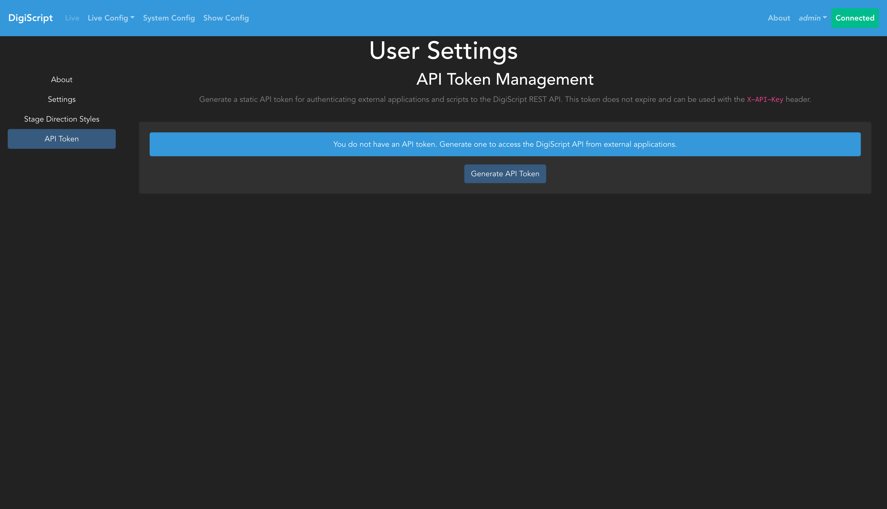

## User Settings

DigiScript provides personal settings that each user can configure for their own account. These settings are accessed by clicking on your username in the top-right navigation bar and are organized into four tabs: About, Settings, Stage Direction Styles, and API Tokens.

### About

The About tab displays information about your user account, including your username and assigned roles.

### Settings

The Settings tab allows you to configure personal preferences for your DigiScript experience:

#### Script Autosave

Configure the script autosave interval to automatically save your script changes while editing. You can set the autosave interval in minutes, or disable autosave entirely if you prefer manual saves.

####

 Cue Position

Choose whether cues are displayed on the left or right side of the script during live shows. This allows you to customize the layout to match your workflow or screen arrangement.

### Stage Direction Styles

DigiScript allows you to customize how stage directions appear in the script with personal color and style preferences:

You can override the system-wide stage direction styling with your own color and font style choices. This is particularly useful if you need different visual contrast or have specific accessibility needs.

### API Tokens

API tokens allow external applications to authenticate with DigiScript and perform actions on your behalf:

#### Generating an API Token

1. Click the **Generate Token** button
2. A new token will be created and displayed
3. **Important**: Copy this token immediately - for security reasons, you won't be able to view it again after leaving this page

#### Managing Tokens

- **Regenerate**: Creates a new token, invalidating the previous one
- **Revoke**: Permanently removes the token and prevents it from being used

API tokens should be treated like passwords and kept secure. If you believe a token has been compromised, regenerate or revoke it immediately.